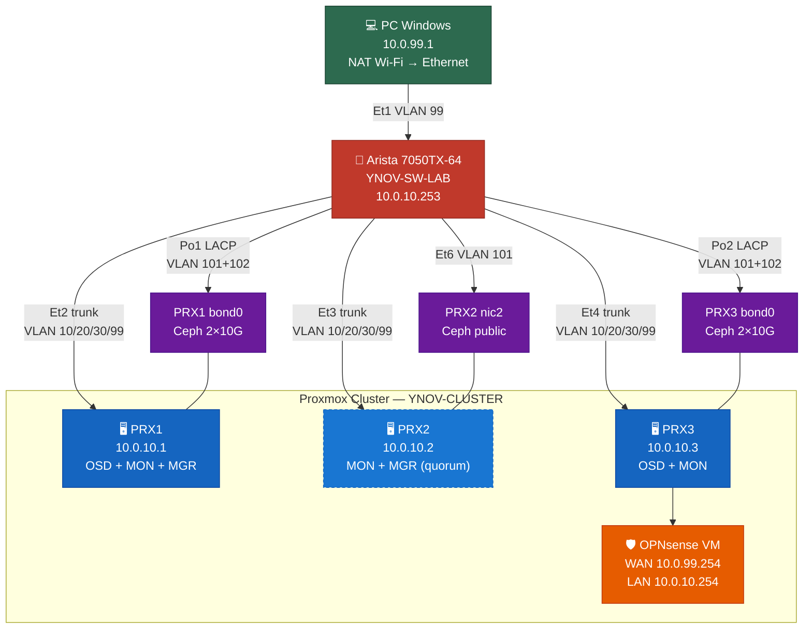
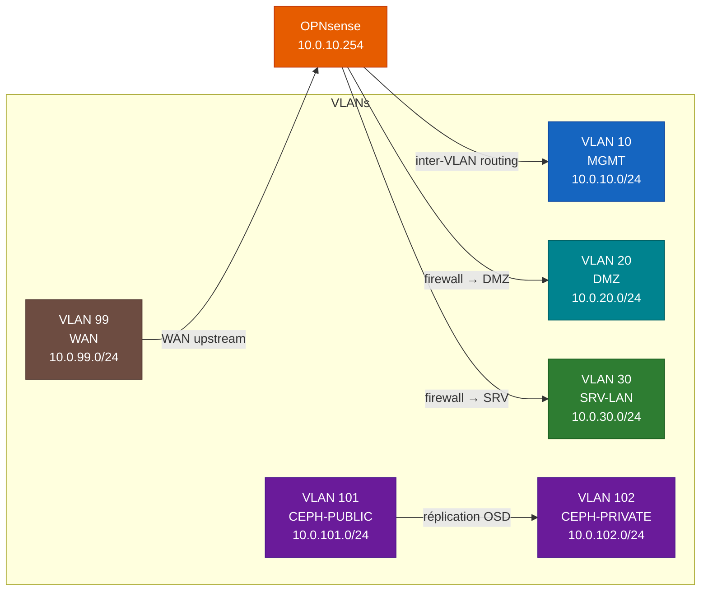
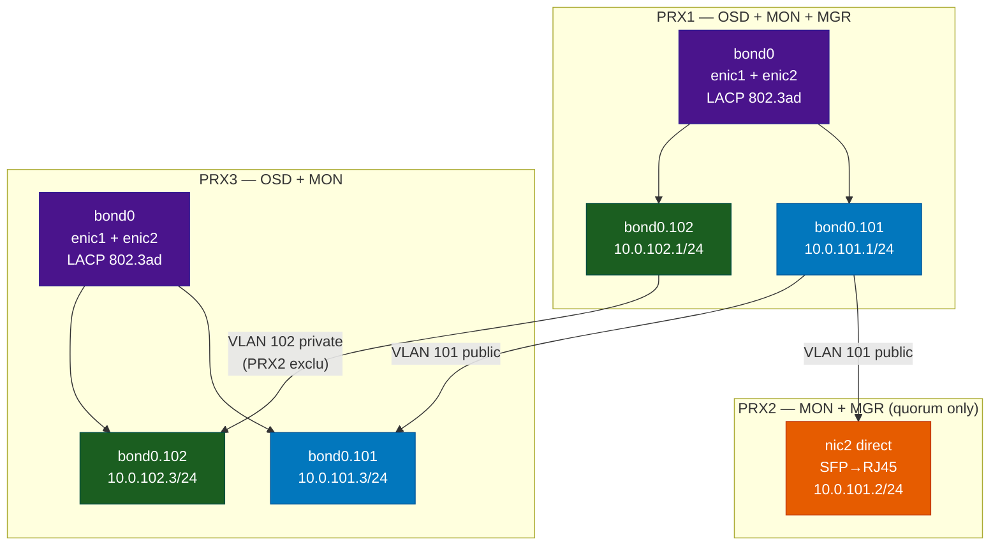

<div align="center">
  
</div>

# ynov-virtu

> **Cours de Virtualisation** — M1 Expert Cloud, Sécurité & Infrastructure  
> YNOV Campus Sophia-Antipolis

Lab orienté entreprise basé sur **Proxmox VE**, **OPNsense**, **Ceph** et un switch **Arista 7050TX-64**.  
Le repo couvre toute la stack : documentation, configs réseau, Infrastructure as Code (Terraform + Ansible) et GitHub Pages.

**Équipe :** Jonathan Panzer · Redouane Kachour · Thibaut Gianola · Sacha Veylon-Busser

<div align="center">
  &nbsp;&nbsp;
  &nbsp;&nbsp;
  &nbsp;&nbsp;
  &nbsp;&nbsp;
  &nbsp;&nbsp;
  &nbsp;&nbsp;
  &nbsp;&nbsp;
  
</div>

---

## Architecture

> **Switch physique** — Arista 7050TX-64 (48× RJ45 10G + 4× QSFP+ 40G SFP)
>
> 



### Flux VLAN



### Réseau Ceph



## Plan réseau

| VLAN | Nom | Réseau | Rôle |
|------|-----|--------|------|
| 10 | MGMT | 10.0.10.0/24 | Management cluster (PRX1=.1, PRX2=.2, PRX3=.3, SW=.253, OPNsense=.254) |
| 20 | DMZ | 10.0.20.0/24 | cloudflared=.5, reverse-proxy=.10 |
| 30 | SRV-LAN | 10.0.30.0/24 | VMs serveurs internes |
| 99 | WAN-OPNSENSE | 10.0.99.0/24 | PC Windows=.1, OPNsense WAN=.2 |
| 101 | CEPH-PUBLIC | 10.0.101.0/24 | PRX1=.1, PRX2=.2, PRX3=.3 |
| 102 | CEPH-PRIVATE | 10.0.102.0/24 | PRX1=.1, PRX3=.3 (PRX2 sans private) |
| 4094 | BLACKHOLE | — | VLAN natif des ports inutilisés + trunks Ceph |

---

## Quickstart

```bash
# 1. Cloner le repo
git clone https://github.com/<org>/ynov-virtu && cd ynov-virtu

# 2. Installer les collections Ansible
ansible-galaxy collection install -r ansible/requirements.yml

# 3. Initialiser Terraform
cd terraform/proxmox
cp terraform.tfvars.example terraform.tfvars  # remplir les variables
terraform init && terraform plan

# 4. Déployer le switch Arista
ansible-playbook ansible/playbooks/arista-network.yml

# 5. Configurer les nœuds Proxmox + Ceph
ansible-playbook ansible/playbooks/site.yml --tags proxmox,ceph
```

---

## Structure du repo

```
ynov-virtu/
│
├── docs/                          # Documentation (GitHub Pages via MkDocs)
│   ├── architecture.md            # Topologie, rôles, choix d'architecture
│   ├── network-plan.md            # Plan IP, VLANs, ports switch
│   ├── proxmox.md                 # Installation et configuration cluster Proxmox
│   ├── ceph.md                    # Déploiement Ceph (OSD, MON, MGR, pools)
│   ├── opnsense.md                # VM OPNsense — interfaces, firewall, NAT
│   ├── windows-nat.md             # Passerelle NAT Windows Wi-Fi→Ethernet
│   ├── security.md                # Politique de sécurité réseau
│   └── troubleshooting.md         # Problèmes rencontrés et résolutions
│
├── configs/
│   ├── arista/
│   │   ├── running-config-current.eos   # Config complète YNOV-SW-LAB
│   │   └── cleanup-commands.eos         # Commandes de reset
│   ├── proxmox/
│   │   ├── prx1-interfaces.example      # /etc/network/interfaces PRX1
│   │   ├── prx2-interfaces.example      # /etc/network/interfaces PRX2
│   │   └── prx3-interfaces.example      # /etc/network/interfaces PRX3
│   ├── opnsense/
│   │   ├── interfaces.md
│   │   ├── firewall-rules.md
│   │   └── nat.md
│   └── windows/
│       └── nat-powershell.ps1
│
├── terraform/
│   └── proxmox/                   # Provider bpg/proxmox ~0.66
│       ├── providers.tf
│       ├── variables.tf
│       ├── main.tf
│       ├── network.tf             # Bridges, bonds, VLANs par nœud
│       ├── vms.tf                 # OPNsense, cloudflared, reverse-proxy
│       ├── outputs.tf
│       ├── terraform.tfvars.example
│       └── modules/vm/            # Module réutilisable (cloud-init)
│
├── ansible/
│   ├── ansible.cfg
│   ├── requirements.yml           # arista.eos, community.general, ansible.windows
│   ├── inventory/
│   │   ├── hosts.yml              # PRX1/2/3, switch Arista, PC Windows
│   │   └── group_vars/
│   │       ├── all.yml            # VLANs, DNS, NTP globaux
│   │       ├── proxmox.yml        # Cluster, Ceph, packages
│   │       └── arista.yml         # VLANs, trunks, ports, Port-Channels
│   ├── playbooks/
│   │   ├── site.yml               # Master playbook (import de tous les autres)
│   │   ├── arista-network.yml     # Switch : VLANs, trunks, LACP, STP
│   │   ├── proxmox-base.yml       # Packages, NTP, repo no-subscription
│   │   ├── proxmox-cluster.yml    # pvecm create + jointure
│   │   ├── ceph.yml               # pveceph init, MON/MGR/OSD, pool
│   │   ├── opnsense-api.yml       # API REST OPNsense
│   │   └── windows-nat.yml        # WinRM + NAT idempotent
│   └── roles/
│       ├── proxmox_base/          # tasks, handlers, templates/chrony.conf.j2
│       ├── proxmox_network/       # tasks, handlers, templates/interfaces.j2
│       ├── ceph/                  # Health checks post-déploiement
│       └── arista_switch/         # Role modulaire Arista EOS
│
├── diagrams/
│   ├── architecture.mmd           # Topologie générale (Mermaid)
│   ├── vlan-flow.mmd              # Flux inter-VLAN
│   └── ceph-network.mmd          # Réseau Ceph (public/private)
│
├── scripts/
│   ├── windows-nat-setup.ps1      # Setup NAT Windows (admin requis)
│   ├── windows-nat-cleanup.ps1    # Suppression NAT
│   └── network-tests.md           # Matrice de validation réseau
│
├── .github/workflows/
│   ├── docs.yml                   # GitHub Pages (MkDocs Material)
│   └── terraform-validate.yml     # CI : fmt + init + validate
│
└── mkdocs.yml                     # Config site de documentation
```

---

## IaC — Terraform

Gère le cycle de vie des ressources Proxmox via le provider [`bpg/proxmox`](https://registry.terraform.io/providers/bpg/proxmox/latest).

- **network.tf** : bridges VLAN-aware, bonds LACP, sous-interfaces Ceph par nœud
- **vms.tf** : VM OPNsense (vm_id=100), cloudflared (101), reverse-proxy (102)
- **modules/vm** : module cloud-init réutilisable (réseau, user, SSH key)

```bash
cd terraform/proxmox
cp terraform.tfvars.example terraform.tfvars
# Remplir proxmox_password, vm_ssh_public_key, etc.
terraform init
terraform plan -out=plan.tfplan
terraform apply plan.tfplan
```

## IaC — Ansible

Gère la configuration des équipements via les collections officielles.

| Collection | Usage |
|------------|-------|
| `arista.eos` ≥6.0.0 | Switch : VLANs, trunks, LACP, STP |
| `community.general` ≥9.0.0 | Proxmox : timezone, packages |
| `ansible.windows` ≥2.0.0 | PC Windows : WinRM, NAT PowerShell |

```bash
# Installer les dépendances
ansible-galaxy collection install -r ansible/requirements.yml

# Tout déployer
ansible-playbook ansible/playbooks/site.yml

# Seulement le switch
ansible-playbook ansible/playbooks/arista-network.yml

# Seulement Ceph
ansible-playbook ansible/playbooks/ceph.yml

# Dry-run
ansible-playbook ansible/playbooks/site.yml --check
```

---

## Documentation en ligne

La documentation est disponible via GitHub Pages (MkDocs Material).  
Déployée automatiquement à chaque push sur `main` via `.github/workflows/docs.yml`.

---

## Licence

MIT
