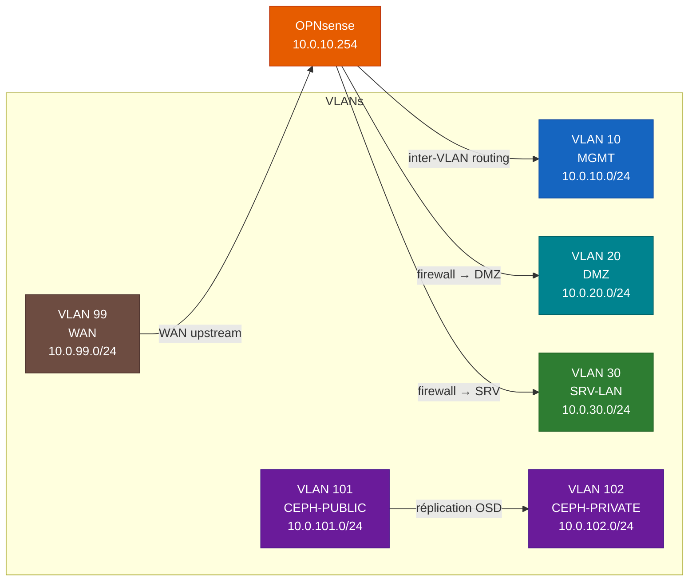

<div align="center">
  
</div>

# ynov-virtu

> **Cours de Virtualisation** - M1 Expert Cloud, Sécurité & Infrastructure  
> YNOV Campus Sophia-Antipolis

Lab orienté entreprise basé sur **Proxmox VE**, **OPNsense**, **Ceph** et un switch **Arista 7050TX-64**.  
Par-dessus cet underlay physique, une **couche workload** (bastion JumpServer, web, db, supervision Zabbix, IPAM/DCIM NetBox) est déployée en **Infrastructure as Code** : **OpenTofu** + **cloud-init** + **Ansible**.

**Équipe :** Jonathan Panzer · Redouane Kachour · Thibaut Gianola · Sacha Veylon-Busser

<div align="center">
  &nbsp;&nbsp;
  &nbsp;&nbsp;
  &nbsp;&nbsp;
  &nbsp;&nbsp;
  &nbsp;&nbsp;
  &nbsp;&nbsp;
  
</div>

---

## Architecture

Le lab s'organise en deux couches :

- **Underlay physique** - cluster Proxmox 3 nœuds, stockage Ceph, switch Arista, pare-feu OPNsense, NAT Windows pour le WAN.
- **Couche workload** - VMs métier provisionnées par OpenTofu et configurées par Ansible, sur les VLANs 20 (DMZ) et 30 (SRV-LAN).

> **Switch physique** - Arista 7050TX-64 (48× RJ45 10G + 4× QSFP+ 40G SFP)
>
> 


### Flux VLAN



### Réseau Ceph


## Plan réseau

| VLAN | Nom | Réseau | Rôle |
|------|-----|--------|------|
| 10 | MGMT | 10.0.10.0/24 | Management cluster (PRX1=.1, PRX2=.2, PRX3=.3, SW=.253, OPNsense=.254) |
| 20 | DMZ | 10.0.20.0/24 | bastion JumpServer=.1, reverse-proxy=.10 |
| 30 | SRV-LAN | 10.0.30.0/24 | web=.4, db=.5, zabbix=.6 |
| 99 | WAN-OPNSENSE | 10.0.99.0/24 | PC Windows=.1, OPNsense WAN=.2 |
| 101 | CEPH-PUBLIC | 10.0.101.0/24 | PRX1=.1, PRX2=.2, PRX3=.3 |
| 102 | CEPH-PRIVATE | 10.0.102.0/24 | PRX1=.1, PRX3=.3 (PRX2 sans private) |
| 4094 | BLACKHOLE | - | VLAN natif des ports inutilisés + trunks Ceph |

## Couche workload (VMs)

VMs provisionnées par OpenTofu (clone d'un template cloud-init) puis configurées par Ansible :

| VM | Rôle | VLAN | IP | vCPU / RAM / Disque |
|----|------|------|----|---------------------|
| **bastion** | JumpServer (PAM) + outils d'admin | 20 - DMZ | `10.0.20.1` | 1 / 1 Go / 16 Go |
| **web** | Frontal nginx + php-fpm | 30 - SRV-LAN | `10.0.30.4` | 2 / 2 Go / 20 Go |
| **db** | Base de données MariaDB | 30 - SRV-LAN | `10.0.30.5` | 2 / 2 Go / 24 Go |
| **zabbix** | Supervision (serveur + web + MariaDB) | 30 - SRV-LAN | `10.0.30.6` | 2 / 3 Go / 24 Go |
| **netbox** | IPAM/DCIM NetBox (docker compose) | 30 - SRV-LAN | `10.0.30.7` | 2 / 4 Go / 30 Go |

---

## Quickstart

```bash
# 1. Cloner le repo
git clone https://github.com/astronas/ynov-virtu && cd ynov-virtu

# 2. Provisionner les VMs avec OpenTofu (clone du template cloud-init)
cd opentofu
cp terraform.tfvars.example terraform.tfvars   # API Proxmox, node, template, réseau
tofu init
tofu apply
cd ..

# 3. Installer les collections + rôle externe Ansible
cd ansible
ANSIBLE_CONFIG=./ansible.cfg ansible-galaxy collection install -r requirements.yml

# 4. Configurer les VMs (socle commun + rôles + services)
ansible-playbook playbooks/roles.yml
```

---

## Structure du repo

```
ynov-virtu/
│
├── docs/                          # Documentation (GitHub Pages via MkDocs)
│   ├── architecture.md            # Topologie physique, rôles, choix d'architecture
│   ├── network-plan.md            # Plan IP, VLANs, ports switch
│   ├── proxmox.md                 # Cluster Proxmox (nœuds, bridges, interfaces)
│   ├── ceph.md                    # Déploiement Ceph (OSD, MON, MGR, pools)
│   ├── opnsense.md                # VM OPNsense - interfaces, firewall, NAT
│   ├── windows-nat.md             # Passerelle NAT Windows Wi-Fi→Ethernet
│   ├── opentofu.md                # IaC - provisioning des VMs (template, provider)
│   ├── ansible.md                 # IaC - configuration des VMs (rôles, services)
│   ├── services.md                # web & db (demoapp) + défaut disque supervisé
│   ├── jumpserver.md              # Bastion PAM JumpServer
│   ├── supervision.md             # Zabbix (serveur, agents, monitoring web)
│   ├── gitlab.md                  # GitLab (remote Git + backend état Terraform)
│   ├── vault.md                   # HashiCorp Vault (secrets)
│   ├── security.md                # Politique de sécurité réseau
│   ├── troubleshooting.md         # Problèmes rencontrés et résolutions
│   └── network-tests.md           # Matrice de validation réseau
│
├── opentofu/                      # Provisioning VMs - Telmate/proxmox + e-breuninger/netbox
│   ├── providers.tf               # Providers Proxmox + NetBox (allocateur d'IP)
│   ├── backend.tf                 # Backend local (HTTP GitLab en option)
│   ├── variables.tf               # Variables + var.vms (bastion / web / db / zabbix / netbox)
│   ├── main.tf                    # proxmox_vm_qemu + netbox_available_ip_address
│   ├── outputs.tf                 # vm_ips + ssh_commands
│   └── terraform.tfvars.example   # Modèle de variables
│
├── cloud-init/                    # user-data #cloud-config par VM (bootstrap 1er boot)
│   ├── bastion-user-data.yaml
│   ├── web-user-data.yaml
│   ├── db-user-data.yaml
│   ├── zabbix-user-data.yaml
│   └── netbox-user-data.yaml
│
├── ansible/
│   ├── ansible.cfg                # inventaire, roles_path, collections_path
│   ├── requirements.yml           # community.zabbix, community.mysql, community.docker, netbox.netbox
│   ├── inventory/
│   │   ├── hosts.ini              # bastion / web / db / zabbix / netbox (+ groupe agents)
│   │   └── group_vars/            # bastion.yml, zabbix.yml, agents.yml, netbox.yml
│   ├── playbooks/
│   │   ├── socle.yml              # rôle common sur tous les hôtes
│   │   ├── roles.yml              # playbook principal (socle + rôles + services)
│   │   ├── netbox-seed.yml        # peuple l'IPAM NetBox depuis le plan réseau
│   │   └── vars/netbox_ipam.yml   # données IPAM (VLANs, préfixes, IPs) du lab
│   ├── roles/                     # common, bastion, docker, web, db, zabbix, netbox
│   └── external/jumpserver/       # rôle externe cloné (astronas/jumpserver)
│
├── configs/                       # Configs de référence
│   ├── arista/                    # running-config + cleanup (EOS)
│   ├── proxmox/                   # /etc/network/interfaces par nœud
│   ├── opnsense/                  # interfaces, firewall, NAT
│   └── windows/                   # NAT PowerShell
│
├── diagrams/                      # Schémas Mermaid (.mmd)
│
├── .github/workflows/
│   ├── docs.yml                   # GitHub Pages (MkDocs Material)
│   └── opentofu-validate.yml      # CI : tofu fmt + init + validate
│
├── old/                           # Ancienne IaC physique (terraform + ansible + scripts)
│
└── mkdocs.yml                     # Config du site de documentation
```

---

## IaC - OpenTofu

Provisionne les **VMs de workload** sur le cluster Proxmox via le provider
[`Telmate/proxmox`](https://registry.terraform.io/providers/Telmate/proxmox/latest) `3.0.2-rc07`,
et s'appuie sur [`e-breuninger/netbox`](https://registry.terraform.io/providers/e-breuninger/netbox/latest)
pour l'allocation d'IP.

- **main.tf** : ressource `proxmox_vm_qemu` (`for_each = var.vms`), clone complet du template, cloud-init (IP, user, DNS), VLAN tag, disque sur le stockage Proxmox.
- **NetBox comme allocateur d'IP** : pour une VM sans `ip` statique, `netbox_available_ip_address` réserve la prochaine adresse libre du `prefix` indiqué. NetBox devient la source de vérité IPAM (fini les IP en dur).
- **variables.tf** : variable `vms` décrivant les VMs (bastion, web, db, zabbix, netbox), plus les providers, le réseau et le template.
- **cloud-init/** : `#cloud-config` par VM pour le bootstrap au premier boot (la config applicative est ensuite gérée par Ansible).
- **backend.tf** : état local par défaut, backend HTTP GitLab en option (commenté).

```bash
cd opentofu
cp terraform.tfvars.example terraform.tfvars
# Renseigner proxmox_api_url, token API, target_node, template_name, gateway...
tofu init
tofu plan -out=plan.tofu
tofu apply plan.tofu
tofu output ssh_commands
```

> **Prérequis** : un template Proxmox Debian 12 compatible cloud-init et un token API avec droits de clonage.

## IaC - Ansible

Configure les VMs après provisioning : socle commun, rôles applicatifs, bastion JumpServer et supervision Zabbix.

| Collection / rôle | Usage |
|-------------------|-------|
| `community.zabbix` (commit `main`) | Serveur, frontend web et agents Zabbix 7.0 (support Debian 13) |
| `community.mysql` | Backend MariaDB des rôles Zabbix |
| `community.docker` `>=3.6,<5` | Déploiement JumpServer et NetBox (docker compose v2) |
| `netbox.netbox` | Peuplement de l'IPAM NetBox (playbook netbox-seed, requiert pynetbox) |
| `astronas/jumpserver` (rôle externe) | Bastion / PAM conteneurisé sur la VM bastion |

- `playbooks/socle.yml` : rôle `common` sur tous les hôtes (paquets, services, durcissement SSH).
- `playbooks/roles.yml` : playbook principal : `bastion` (+ docker + jumpserver), `zabbix` (serveur/web/agent), `web` et `db` (+ agent Zabbix), `netbox` (docker + netbox-docker + agent Zabbix).
- `playbooks/netbox-seed.yml` : peuple l'IPAM NetBox (VLANs, préfixes, IPs) depuis `docs/network-plan.md`, via la collection `netbox.netbox`.

```bash
cd ansible

# Installer les dépendances (collections + rôle externe)
ANSIBLE_CONFIG=./ansible.cfg ansible-galaxy collection install -r requirements.yml

# Tout configurer
ansible-playbook playbooks/roles.yml

# Socle commun seul
ansible-playbook playbooks/socle.yml

# Dry-run
ansible-playbook playbooks/roles.yml --check
```

> **Sécurité** : certains `group_vars` contiennent encore des secrets en clair (`CHANGE_ME`). Les migrer vers un `vault.yml` chiffré (`ansible-vault`) avant tout usage réel.

---

## Documentation en ligne

La documentation est disponible via GitHub Pages (MkDocs Material).  
Déployée automatiquement à chaque push sur `main` via `.github/workflows/docs.yml`.

---

## Licence

MIT
