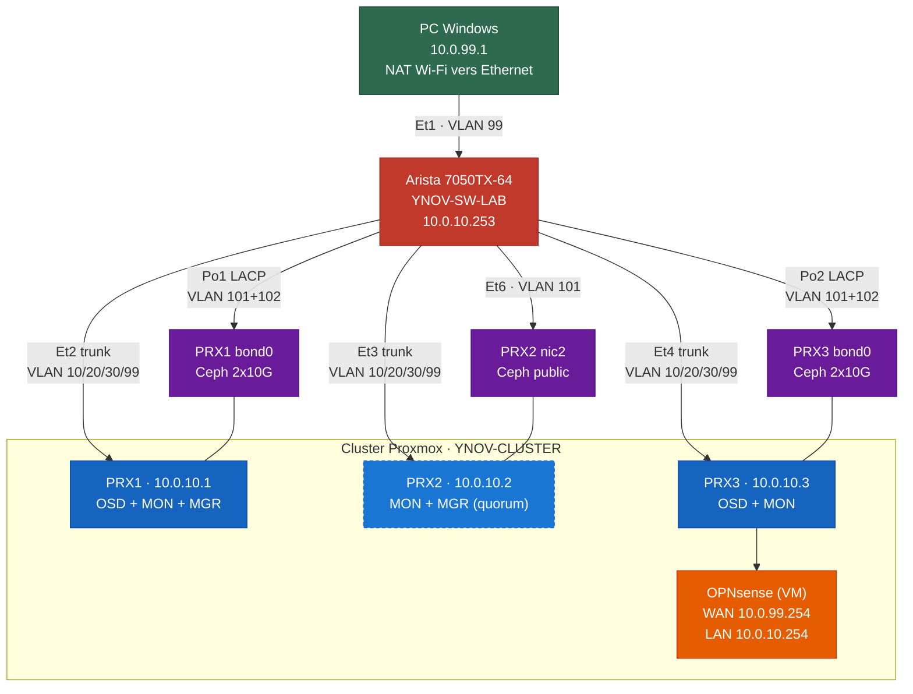

<div align="center">

<picture>
  <source media="(prefers-color-scheme: dark)" srcset="docs/assets/logo_ynov_campus_sophia-white.png">
  
</picture>

<h1>ynov-virtu</h1>

<p>
<strong>Lab d'infrastructure virtualisée orienté entreprise.</strong><br>
Cluster Proxmox VE haute disponibilité, stockage Ceph, segmentation réseau et pare-feu OPNsense,<br>
couche applicative déployée intégralement en Infrastructure as Code.
</p>

[](https://astronas.github.io/ynov-virtu/)
[](https://github.com/astronas/ynov-virtu/actions/workflows/opentofu-validate.yml)
[](LICENSE)

<p>
<a href="https://astronas.github.io/ynov-virtu/"><strong>Documentation en ligne</strong></a> &nbsp;·&nbsp;
<a href="https://astronas.github.io/ynov-virtu/architecture/">Architecture</a> &nbsp;·&nbsp;
<a href="https://astronas.github.io/ynov-virtu/network-plan/">Plan réseau</a> &nbsp;·&nbsp;
<a href="https://astronas.github.io/ynov-virtu/opentofu/">Déploiement IaC</a>
</p>

</div>

---

## Aperçu

`ynov-virtu` reproduit une infrastructure d'entreprise de bout en bout, du câblage physique jusqu'aux applications, en séparant clairement deux couches :

- **Underlay physique** : cluster Proxmox VE à 3 nœuds, stockage distribué Ceph hyperconvergé, switch Arista 7050TX-64 et pare-feu OPNsense assurant le routage inter-VLAN.
- **Couche applicative** : bastion d'administration (PAM), serveurs web et base de données, supervision et IPAM/DCIM, provisionnés puis configurés sans aucune intervention manuelle.

Projet réalisé dans le cadre du module Virtualisation du M1 Expert Cloud, Sécurité & Infrastructure (Ynov Campus Sophia-Antipolis).

## Points clés

<div align="center">

| Domaine | Mise en œuvre |
|:--|:--|
| **Virtualisation** | Cluster Proxmox VE 3 nœuds : quorum, stockage partagé, migration à chaud |
| **Stockage** | Ceph hyperconvergé (OSD / MON / MGR), réseaux public et privé dédiés en LACP |
| **Réseau** | 6 VLANs segmentés (802.1Q), agrégation LACP, VLAN blackhole pour les ports inutilisés |
| **Sécurité** | Pare-feu OPNsense (routage inter-VLAN, DMZ), bastion PAM JumpServer, secrets HashiCorp Vault |
| **Infrastructure as Code** | Provisioning OpenTofu, bootstrap cloud-init, configuration Ansible idempotente |
| **IPAM** | NetBox comme source de vérité, allocation d'IP dynamique pilotée par OpenTofu |
| **Observabilité** | Supervision Zabbix (serveur, agents, monitoring applicatif) |
| **CI/CD** | GitHub Actions : validation OpenTofu et documentation déployée à chaque push |

</div>

## Stack technique

<div align="center">


</div>

## Architecture



> Switch physique : **Arista 7050TX-64** (48x RJ45 10G + 4x QSFP+ 40G).
> Le détail des flux inter-VLAN et de la topologie Ceph est documenté dans [Architecture](https://astronas.github.io/ynov-virtu/architecture/) et [Plan réseau](https://astronas.github.io/ynov-virtu/network-plan/).

### Plan réseau

<div align="center">

| VLAN | Rôle | Réseau |
|:--:|:--|:--|
| 10 | MGMT (management cluster) | `10.0.10.0/24` |
| 20 | DMZ (bastion, reverse-proxy) | `10.0.20.0/24` |
| 30 | SRV-LAN (web, db, supervision) | `10.0.30.0/24` |
| 99 | WAN (uplink OPNsense) | `10.0.99.0/24` |
| 101 / 102 | Ceph public / privé | `10.0.101.0/24`, `10.0.102.0/24` |
| 4094 | Blackhole (ports inutilisés) | (aucun) |

</div>

### Couche applicative

<div align="center">

| VM | Rôle | VLAN | IP |
|:--|:--|:--:|:--|
| **bastion** | JumpServer (PAM) et outils d'administration | DMZ | `10.0.20.1` |
| **web** | Frontal nginx + php-fpm | SRV-LAN | `10.0.30.4` |
| **db** | Base de données MariaDB | SRV-LAN | `10.0.30.5` |
| **zabbix** | Supervision | SRV-LAN | `10.0.30.6` |
| **netbox** | IPAM / DCIM | SRV-LAN | `10.0.30.7` |

</div>

## Déploiement

Trois étapes, entièrement automatisées :

```bash
# 1. Provisionner les VMs (clone du template cloud-init sur Proxmox)
cd opentofu
cp terraform.tfvars.example terraform.tfvars   # API Proxmox, nœud, template, réseau
tofu init && tofu apply

# 2. Installer les dépendances Ansible (collections + rôle externe)
cd ../ansible
ANSIBLE_CONFIG=./ansible.cfg ansible-galaxy collection install -r requirements.yml

# 3. Configurer les VMs (socle commun, rôles applicatifs, services)
ansible-playbook playbooks/roles.yml
```

Guides pas à pas : [OpenTofu et cloud-init](https://astronas.github.io/ynov-virtu/opentofu/) &nbsp;·&nbsp; [Ansible](https://astronas.github.io/ynov-virtu/ansible/).

> **Prérequis :** un template Proxmox Debian 12 compatible cloud-init et un token API Proxmox avec droits de clonage.

## Documentation

Toute la conception, les choix d'architecture et les procédures sont publiés sur le site de documentation, généré avec [Zensical](https://zensical.org) et déployé sur GitHub Pages :

<div align="center">

**<https://astronas.github.io/ynov-virtu/>**

| Section | Contenu |
|:--|:--|
| [Architecture](https://astronas.github.io/ynov-virtu/architecture/) | Topologie physique, rôles des nœuds, choix de conception |
| [Plan réseau](https://astronas.github.io/ynov-virtu/network-plan/) | Plan d'adressage, VLANs, ports du switch |
| [Proxmox](https://astronas.github.io/ynov-virtu/proxmox/) · [Ceph](https://astronas.github.io/ynov-virtu/ceph/) | Cluster, bridges, interfaces, déploiement du stockage |
| [OPNsense](https://astronas.github.io/ynov-virtu/opnsense/) · [Vault](https://astronas.github.io/ynov-virtu/vault/) · [JumpServer](https://astronas.github.io/ynov-virtu/jumpserver/) | Pare-feu, secrets, bastion |
| [OpenTofu](https://astronas.github.io/ynov-virtu/opentofu/) · [Ansible](https://astronas.github.io/ynov-virtu/ansible/) · [NetBox](https://astronas.github.io/ynov-virtu/netbox/) | Provisioning, configuration, IPAM |
| [Supervision](https://astronas.github.io/ynov-virtu/supervision/) · [Sécurité](https://astronas.github.io/ynov-virtu/security/) · [Tests réseau](https://astronas.github.io/ynov-virtu/network-tests/) | Zabbix, politique de sécurité, matrice de validation |

</div>

## Structure du dépôt

<details>
<summary>Arborescence</summary>

```
ynov-virtu/
├── opentofu/          # Provisioning des VMs (OpenTofu + providers Proxmox / NetBox)
├── cloud-init/        # Bootstrap #cloud-config par VM (premier boot)
├── ansible/           # Configuration : socle commun, rôles applicatifs, services
├── configs/           # Configs de référence (Arista, Proxmox, OPNsense, Windows)
├── diagrams/          # Schémas Mermaid source (.mmd)
├── docs/              # Documentation (site Zensical / GitHub Pages)
├── overrides/         # Surcharges de thème Zensical
├── old/               # Ancienne IaC physique (référence)
├── .github/workflows/ # CI : validation OpenTofu, déploiement de la documentation
└── zensical.toml      # Configuration du site de documentation
```

</details>

## Équipe

<div align="center">
<table>
<tr>
<td align="center" width="180">
<a href="https://github.com/astronas">
<br>
<sub><b>Thibaut Gianola</b></sub>
</a><br>
<sub>@astronas</sub>
</td>
<td align="center" width="180">
<a href="https://github.com/Sorway">
<br>
<sub><b>Jonathan Panzer</b></sub>
</a><br>
<sub>@Sorway</sub>
</td>
<td align="center" width="180">
<br>
<sub><b>Redouane Kachour</b></sub><br>
<sub>&nbsp;</sub>
</td>
<td align="center" width="180">
<a href="https://github.com/veysacha">
<br>
<sub><b>Sacha Veylon-Busser</b></sub>
</a><br>
<sub>@veysacha</sub>
</td>
</tr>
</table>
</div>

## Licence

Distribué sous licence [MIT](LICENSE).
