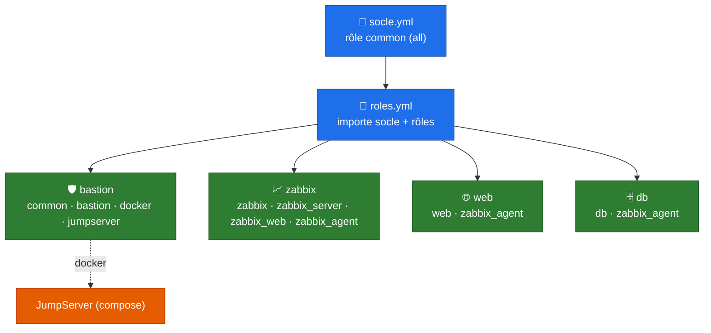

# Configuration Ansible

## Présentation

Une fois les VMs provisionnées par [OpenTofu](opentofu.md), 
**Ansible** applique toute la configuration : socle commun, rôles applicatifs (web, db),
bastion **JumpServer** (PAM) et **supervision Zabbix** centralisée.



!!! warning "Ordre d'exécution"
    Le serveur **Zabbix est configuré AVANT** les hôtes `web`/`db` : ceux-ci s'enregistrent
    automatiquement auprès du serveur via l'API (`zabbix_api_create_hosts`), donc le frontend
    doit déjà tourner.

---

## Arborescence

```
ansible/
├── ansible.cfg               # inventaire, roles_path, collections_path, log + profile_tasks
├── requirements.yml          # collections Galaxy + community.zabbix (commit git)
├── inventory/
│   ├── hosts.ini             # bastion / web / db / zabbix (+ groupe agents)
│   └── group_vars/
│       ├── bastion.yml       # variables JumpServer (PAM)
│       ├── zabbix.yml        # serveur Zabbix + MariaDB locale
│       └── agents.yml        # agent Zabbix + auto-enregistrement API (web, db)
├── playbooks/
│   ├── socle.yml             # rôle common sur tous les hôtes
│   └── roles.yml             # playbook principal (socle + rôles par groupe)
├── roles/                    # rôles locaux
│   ├── common/               # socle : paquets, services, durcissement SSH
│   ├── bastion/              # outils d'admin (nmap, tcpdump, mtr...)
│   ├── docker/               # Docker Engine + Compose (prérequis JumpServer)
│   ├── web/                  # nginx + php-fpm
│   ├── db/                   # MariaDB
│   └── zabbix/               # prérequis MariaDB/PyMySQL du serveur Zabbix
├── external/jumpserver/      # rôle externe cloné (astronas/jumpserver)
└── collections/              # collections installées localement
```

---

## Inventaire

`inventory/hosts.ini` :

| Hôte | Groupe | `ansible_host` | Supervisé (agent) |
|------|--------|----------------|-------------------|
| bastion | `[bastion]` | `10.0.20.1` | — |
| web | `[web]` | `10.0.30.4` | ✅ (`[agents]`) |
| db | `[db]` | `10.0.30.5` | ✅ (`[agents]`) |
| zabbix | `[zabbix]` | `10.0.30.6` | auto (serveur) |

Le groupe `[agents:children]` regroupe `web` + `db` (variables communes dans
`group_vars/agents.yml`). Connexion via `ansible_user=admin-tmpl`.

---

## Rôles locaux

| Rôle | Cible | Rôle joué |
|------|-------|-----------|
| `common` | tous | Paquets de base (curl, vim, git, htop, chrony, rsyslog, qemu-guest-agent), services, **durcissement SSH** (`PermitRootLogin no`) |
| `bastion` | bastion | Outils d'administration : `nmap`, `tcpdump`, `mtr-tiny`, `openssh-client` |
| `docker` | bastion | Docker Engine + plugin Compose (dépôt officiel Docker) — prérequis JumpServer |
| `web` | web | `nginx`, `php-fpm`, `php-mysql`, `php-cli` + arborescence `/var/www/app` |
| `db` | db | `mariadb-server` / `mariadb-client` |
| `zabbix` | zabbix | MariaDB locale + `python3-pymysql` (prérequis des rôles `community.zabbix`) |

---

## Collections & rôle externe

`requirements.yml` (installées dans `./collections`, cf. `ansible.cfg`) :

| Collection | Usage |
|------------|-------|
| `community.zabbix` *(commit `main`)* | Rôles `zabbix_server` / `zabbix_web` / `zabbix_agent` — épinglé sur un commit de `main` pour le support **Debian 13** |
| `community.mysql` | Backend MySQL/MariaDB des rôles Zabbix |
| `community.docker` `>=3.6,<5` | Déploiement JumpServer (docker compose v2) |
| `ansible.posix`, `community.general`, `ansible.netcommon` | Dépendances diverses |

Le rôle **`jumpserver`** est fourni par le dépôt externe `astronas/jumpserver`, cloné dans
`external/jumpserver/` et exposé via `roles_path` (`ansible.cfg`).

---

## Services déployés

###  Bastion — JumpServer (PAM)

Bastion d'accès / **Privileged Access Management** déployé en conteneurs (docker compose v2),
version **`v4.10.16`**.

| Port | Service |
|------|---------|
| `80` | Frontend web JumpServer |
| `2222` | Accès SSH via le proxy **KoKo** |
| `3389` | Accès RDP via le proxy **Lion** |

Variables dans `group_vars/bastion.yml` (clé secrète, bootstrap token, mots de passe DB/Redis).

### 📈 Supervision Zabbix

Pile de supervision **Zabbix 7.0 LTS** sur l'hôte `zabbix` :

- `community.zabbix.zabbix_server` — serveur (backend MariaDB local) ;
- `community.zabbix.zabbix_web` — frontend nginx + php-fpm ;
- `community.zabbix.zabbix_agent` — agent2 local (auto-supervision).

Les hôtes `web` et `db` installent l'**agent2** et **s'enregistrent automatiquement** sur le serveur
via l'API (`zabbix_api_create_hosts`), liés au groupe *Linux servers* et au template
*Linux by Zabbix agent* (cf. `group_vars/agents.yml`).

### 🌐 Web & 🗄 DB

- **web** : frontal nginx + php-fpm + agent Zabbix.
- **db** : MariaDB + agent Zabbix.

---

## Quickstart

```bash
cd ansible

# 1. Installer collections + rôle externe
ANSIBLE_CONFIG=./ansible.cfg ansible-galaxy collection install -r requirements.yml

# 2. Socle commun seul (optionnel)
ansible-playbook playbooks/socle.yml

# 3. Déploiement complet (socle + rôles + services)
ansible-playbook playbooks/roles.yml

# Dry-run
ansible-playbook playbooks/roles.yml --check
```

!!! danger "Secrets en clair — à migrer vers Ansible Vault"
    Plusieurs `group_vars` contiennent encore des secrets en clair (clés JumpServer, mots de passe
    Zabbix/MariaDB) marqués `CHANGE_ME` / `TODO`. Avant tout usage réel, les déplacer dans un
    `vault.yml` chiffré (`ansible-vault encrypt`) et lancer avec `--ask-vault-pass`.

---

## Voir aussi

- [Déploiement OpenTofu & cloud-init](opentofu.md) — provisionnement des VMs en amont
- [Plan réseau & VLANs](network-plan.md) — adressage des VMs
- [Sécurité](security.md) — durcissement et politique réseau
