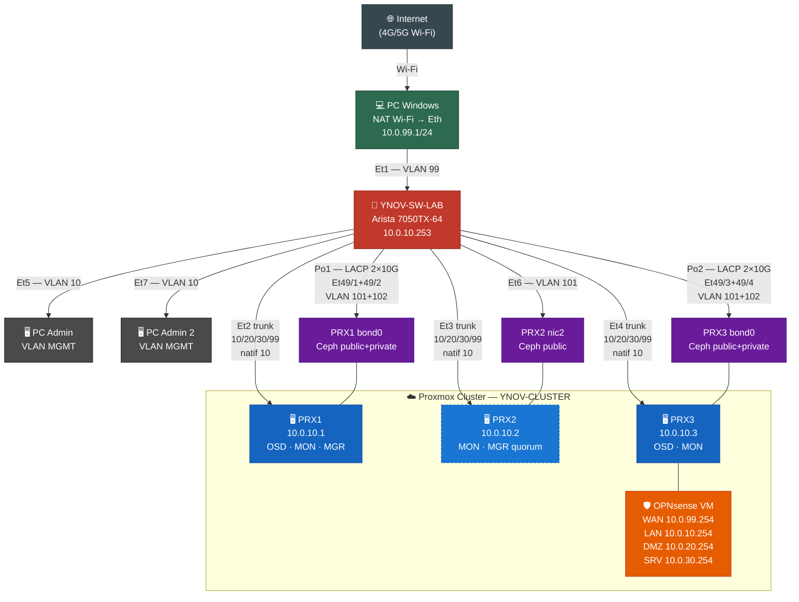
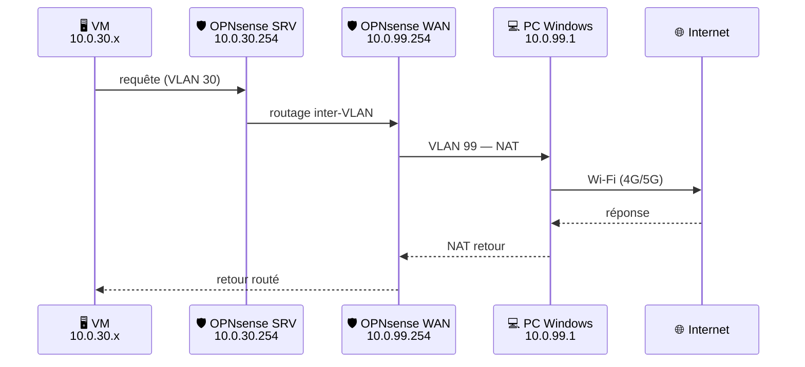
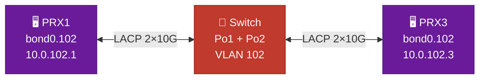
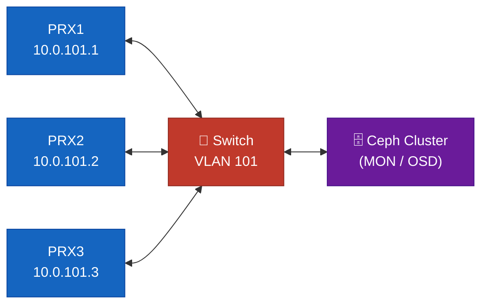

# Architecture — Vue d'ensemble

## Présentation générale

Le lab YNOV-VIRTU est une infrastructure de virtualisation d'entreprise miniaturisée, construite autour de trois couches :

1. **Couche réseau** — Switch Arista 7050TX-64  (`YNOV-SW-LAB`), segmentation VLAN, LACP pour Ceph .
2. **Couche compute** — Cluster Proxmox  3 nœuds (PRX1, PRX2, PRX3), hyperviseur KVM/LXC.
3. **Couche service** — OPNsense  (routage/firewall), Ceph  (stockage distribué), Windows NAT (WAN temporaire).

---

## Topologie physique



### Schéma de brassage


---

## Composants et rôles

###  Switch Arista 7050TX-64

{ style="height:220px;width:auto" }

Le switch est le cœur L2 du lab. Il assure :

- La segmentation VLAN (10, 20, 30, 99, 101, 102, 4094).
- Les trunks vers les trois nœuds Proxmox (VLANs 10/20/30/99, natif 10).
- L'agrégation LACP pour les réseaux Ceph de PRX1 (Po1) et PRX3 (Po2).
- L'accès WAN du PC Windows (Et1, VLAN 99).
- La connectivité Ceph public de PRX2 (Et6, VLAN 101).
- La sécurisation des ports inutilisés (shutdown + VLAN 4094).

###  PRX1

- **Rôle Proxmox** : nœud de compute, héberge des VMs de workload.
- **Rôle Ceph** : OSD (stockage de données), MON/MGR possible.
- **Réseaux** : MGMT/DMZ/SRV/WAN via trunk `Et2`, Ceph public+private via `Po1` (LACP 2×10G, Et49/1+49/2).

###  PRX2

- **Rôle Proxmox** : nœud de compute, héberge des VMs de workload.
- **Rôle Ceph** : quorum/management (MON, MGR), **pas d'OSD**. Pas de réseau Ceph private.
- **Réseaux** : MGMT/DMZ/SRV/WAN via trunk `Et3`, Ceph public uniquement via `Et6` (VLAN 101, SFP→RJ45).

###  PRX3

- **Rôle Proxmox** : nœud de compute, héberge la VM OPNsense.
- **Rôle Ceph** : OSD (stockage de données), MON/MGR possible.
- **Réseaux** : MGMT/DMZ/SRV/WAN via trunk `Et4`, Ceph public+private via `Po2` (LACP 2×10G, Et49/3+49/4).

###  OPNsense

VM hébergée sur PRX3. Sert de passerelle et pare-feu pour l'ensemble du lab :

- **WAN** : `10.0.99.254/24` — récupère Internet depuis le PC Windows via NAT.
- **LAN/MGMT** : `10.0.10.254/24` — gateway du VLAN management.
- **DMZ** : `10.0.20.254/24` — gateway de la zone DMZ.
- **SRV/LAN** : `10.0.30.254/24` — gateway des services internes.

### 💻 PC Windows

Passerelle WAN temporaire. Partage une connexion Wi-Fi (4G/5G ou autre) vers le VLAN 99 via NAT PowerShell. Connecté au switch via `Et1` (VLAN 99 access).

---

## Couche workload (VMs)

Au-dessus de l'underlay physique, les VMs métier sont déployées en IaC (OpenTofu + cloud-init + Ansible) :

| VM | Rôle | VLAN | IP |
|----|------|------|----|
| **bastion** | JumpServer (PAM) + outils d'admin | 20 — DMZ | `10.0.20.1` |
| **web** | Frontal nginx + php-fpm | 30 — SRV-LAN | `10.0.30.4` |
| **db** | Base de données MariaDB | 30 — SRV-LAN | `10.0.30.5` |
| **zabbix** | Supervision (serveur + web + MariaDB) | 30 — SRV-LAN | `10.0.30.6` |

> Détails du provisionnement : [OpenTofu & cloud-init](opentofu.md) · [Configuration Ansible](ansible.md)

---

## Décisions d'architecture

### Pourquoi OPNsense sur PRX3 et non une appliance dédiée ?

L'objectif est de maximiser l'usage du matériel disponible. PRX3 porte les OSD Ceph et OPNsense simultanément. En production, OPNsense serait idéalement sur du matériel dédié ou avec des ressources CPU/RAM réservées.

### Pourquoi VLAN natif 10 sur les trunks Proxmox ?

Le management Proxmox (interface web, SSH, corosync) doit rester accessible sans tag VLAN. En plaçant le VLAN 10 comme natif sur les trunks `Et2/Et3/Et4`, le trafic non tagué est automatiquement dans le VLAN MGMT. Cela simplifie le boot et l'accès initial.

### Pourquoi LACP pour  Ceph ?

Ceph génère un trafic réseau intense lors des opérations de réplication (réseau private VLAN 102) et d'accès client (réseau public VLAN 101). Le LACP 2×10G offre à la fois la redondance et l'augmentation de bande passante effective pour PRX1 et PRX3.

### Pourquoi PRX2 sans réseau Ceph private ?

PRX2 ne porte pas d'OSD. Il ne participe pas à la réplication inter-OSD. Son rôle Ceph (MON, MGR) ne nécessite que le réseau public. Le réseau private est exclusivement utilisé pour la réplication entre OSD (PRX1 ↔ PRX3).

### Pourquoi VLAN 4094 comme blackhole ?

Le VLAN 1 est le VLAN natif par défaut sur Arista. Pour éviter les attaques de VLAN hopping (double-tagging sur VLAN 1), tous les ports inutilisés sont placés dans un VLAN inexistant (4094) et mis en shutdown. Les trunks Ceph utilisent aussi 4094 comme VLAN natif.

---

## Flux de données principaux

### Accès Internet depuis une VM interne (VLAN 30)



### Réplication Ceph (inter-OSD)



### Accès client Ceph (VLAN 101)



---

## Configuration switch Arista (running-config)

Configuration complète exportée depuis le switch (`show running-config`) — **EOS 4.20.12M** :

```eos
! device: YNOV-SW-LAB (DCS-7050TX-64, EOS-4.20.12M)

hostname YNOV-SW-LAB
spanning-tree mode mstp
environment fan-speed override 30

! --- VLANs ---
vlan 10  → MGMT
vlan 20  → DMZ
vlan 30  → SRV-LAN
vlan 99  → WAN-FUTUR-OPNSENSE
vlan 101 → CEPH-PUBLIC
vlan 102 → CEPH-PRIVATE
vlan 4094 → BLACKHOLE-NATIVE

! --- Ports actifs ---
Et1  : access vlan 99          → PC Windows (NAT WAN vers OPNsense)
Et2  : trunk 10,20,30,99       → PRX1 (native vlan 10)
Et3  : trunk 10,20,30,99       → PRX2 (native vlan 10)
Et4  : trunk 10,20,30,99       → PRX3 / OPNsense (native vlan 10)
Et5  : access vlan 10          → PC Admin MGMT
Et6  : access vlan 101         → PRX2 Ceph public (NIC2 SFP-RJ45)
Et7  : access vlan 10          → PC Admin MGMT2

! --- LACP Ceph ---
Po1 (Et49/1+Et49/2) : trunk vlan 101-102, native 4094, mtu 9000 → PRX1 Ceph
Po2 (Et49/3+Et49/4) : trunk vlan 101-102, native 4094, mtu 9000 → PRX3 Ceph

! --- Sécurité ---
Et8-Et48, Et50-Et52 : shutdown, access vlan 4094 (blackhole)
interface Vlan1 : shutdown (neutralisation VLAN 1)

! --- Routage management ---
interface Vlan10 : ip address 10.0.10.253/24
ip route 0.0.0.0/0 10.0.10.254
ip routing
```

> Fichier complet : [`configs/arista/running-config-current.eos`](../configs/arista/running-config-current.eos)


---

## Voir aussi

- [docs/network-plan.md](network-plan.md) — Plan IP complet et rôles des ports switch
- [diagrams/architecture.mmd](../diagrams/architecture.mmd) — Schéma Mermaid
- [docs/proxmox.md](proxmox.md) — Configuration des nœuds
- [docs/ceph.md](ceph.md) — Déploiement du cluster Ceph
