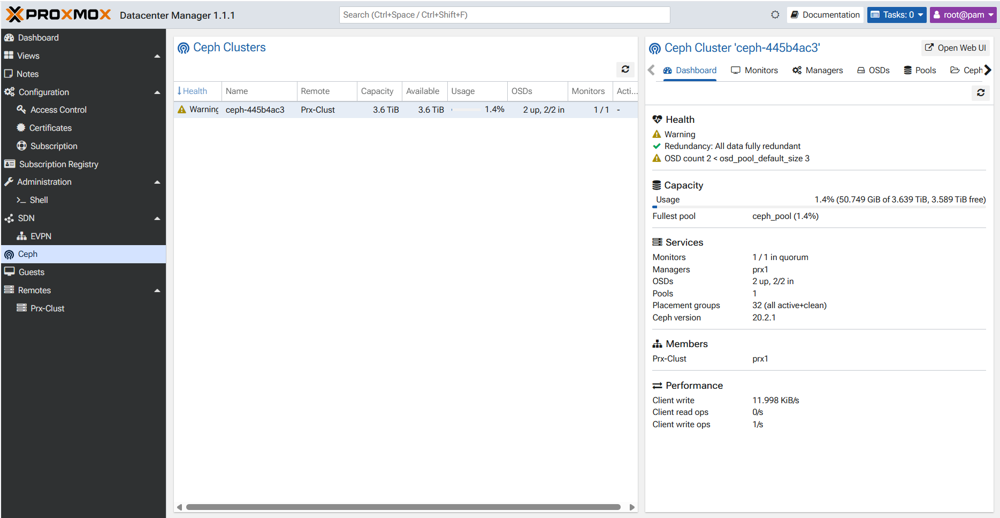

# Ceph — Stockage distribué

## Architecture Ceph du lab

| Nœud | Rôle Ceph | OSD | MON | MGR | Réseau public (101) | Réseau private (102) |
|---|---|---|---|---|---|---|
| PRX1 | OSD + MON + MGR | ✅ | ✅ | ✅ | `10.0.101.1/24` | `10.0.102.1/24` |
| PRX2 | MON + MGR + Quorum | ❌ | ✅ | ✅ | `10.0.101.2/24` | — |
| PRX3 | OSD + MON | ✅ | ✅ | — | `10.0.101.3/24` | `10.0.102.3/24` |

**PRX2 ne porte pas d'OSD.** Il sert uniquement de tiebreaker/quorum pour garantir le quorum Ceph sans doubler le stockage. Il accède au cluster via le réseau public uniquement.

---

## Prérequis

Avant d'initialiser Ceph :

1. Le cluster Proxmox doit être opérationnel (voir [docs/proxmox.md](proxmox.md)).
2. Les réseaux Ceph doivent être connectés et testés :
   - VLAN 101 : `ping 10.0.101.1`, `10.0.101.2`, `10.0.101.3`
   - VLAN 102 : `ping 10.0.102.1`, `10.0.102.3`
3. Les disques OSD doivent être vierges (sans partition, sans filesystem).

Vérifier les disques disponibles pour OSD :

```bash
# Sur PRX1 et PRX3
lsblk
ceph-volume inventory
```

---

## Initialisation Ceph via l'interface Proxmox

### Étape 1 — Créer le cluster Ceph sur PRX1

Dans Proxmox GUI → `PRX1` → `Ceph` → `Install Ceph` :

- **Public Network** : `10.0.101.0/24`
- **Cluster Network** : `10.0.102.0/24`
- **Min replicas** : `2`
- **Target replicas** : `2` (uniquement 2 OSD disponibles)

Ou en ligne de commande depuis PRX1 :

```bash
pveceph init --network 10.0.101.0/24 --cluster-network 10.0.102.0/24
```

### Étape 2 — Installer Ceph sur PRX2 et PRX3

Depuis l'interface Proxmox de chaque nœud → `Ceph` → `Install Ceph`.

Le réseau cluster sera automatiquement ignoré sur PRX2 (pas d'interface `bond0.102`).

### Étape 3 — Créer les MONs

Sur les trois nœuds, créer le MON :

```bash
# Sur PRX1, PRX2, PRX3
pveceph mon create
```

Vérifier :

```bash
ceph mon stat
ceph quorum_status --format json-pretty
```

### Étape 4 — Créer le MGR

```bash
# Sur PRX1 (actif) et PRX2 (standby)
pveceph mgr create
```

Vérifier :

```bash
ceph mgr stat
```

### Étape 5 — Créer les OSD

Sur **PRX1** uniquement (adapter `/dev/sdX` au disque réel) :

```bash
pveceph osd create /dev/sdb
# Répéter pour chaque disque OSD disponible sur PRX1
```

Sur **PRX3** uniquement :

```bash
pveceph osd create /dev/sdb
# Répéter pour chaque disque OSD disponible sur PRX3
```

Vérifier :

```bash
ceph osd stat
ceph osd tree
```

### Étape 6 — Créer un pool Ceph

```bash
# Pool pour les images de VMs Proxmox
pveceph pool create vm-pool --add_storages
```

Ou depuis Proxmox GUI → `Ceph` → `Pools` → `Create`.

---

## Configuration Ceph avancée

### Ajuster le nombre de réplicas

Avec seulement 2 OSD (PRX1 et PRX3), le minimum viable est `size=2, min_size=1` :

```bash
ceph osd pool set vm-pool size 2
ceph osd pool set vm-pool min_size 1
```

> **Attention** : `min_size=1` signifie que les données sont accessibles même si un OSD est indisponible, au risque de perte de données en cas de panne simultanée. Acceptable en lab, à éviter en production.

### Vérifier la santé du cluster

```bash
ceph status
ceph health detail
ceph df
ceph osd df
```

### Surveillance des IOPS et de la bande passante

```bash
ceph osd perf
rados bench -p vm-pool 10 write --no-cleanup
rados bench -p vm-pool 10 seq
rados bench -p vm-pool 10 rand
```

---

## Rôle de PRX2 dans le quorum

Sans PRX2, avec seulement PRX1 et PRX3 comme MON, la perte d'un des deux nœuds entraînerait la perte du quorum (2 MON, besoin de la majorité = 2). PRX2 porte le troisième MON pour garantir le quorum même si un nœud OSD est indisponible.

```
Quorum Ceph (3 MON) :
  PRX1 (MON) + PRX2 (MON) + PRX3 (MON)
  → quorum atteint avec 2 MON sur 3
  → PRX1 peut tomber → PRX2 + PRX3 maintiennent le quorum
  → PRX3 peut tomber → PRX1 + PRX2 maintiennent le quorum
```

---

## Intégration Proxmox ↔ Ceph

Une fois le pool créé, l'ajouter dans Proxmox comme stockage :

```bash
# Ajouter le pool Ceph comme stockage Proxmox (si non fait via GUI)
pvesm add rbd vm-pool --pool vm-pool --content images,rootdir
```

Vérifier dans Proxmox GUI → `Datacenter` → `Storage` : le pool `vm-pool` doit apparaître.

---

## Commandes de dépannage Ceph

```bash
# Statut global
ceph status
ceph health detail

# OSD map
ceph osd dump
ceph osd tree
ceph osd stat

# Logs OSD (sur le nœud concerné)
journalctl -u ceph-osd@0
journalctl -u ceph-osd@1

# MON logs
journalctl -u ceph-mon@prx1
ceph mon dump

# Forcer le rebalancing après ajout OSD
ceph osd reweight-by-utilization

# PG status
ceph pg stat
ceph pg dump | grep -v active+clean

# Réseau — vérifier MTU (recommandé 9000 pour Ceph si possible)
ip link show bond0
ip link show bond0.101
ip link show bond0.102
```

---

## Voir aussi

### Capture du statut Ceph



---

- [diagrams/ceph-network.mmd](../diagrams/ceph-network.mmd) — Topologie réseau Ceph
- [configs/proxmox/](../configs/proxmox/) — Interfaces réseau des nœuds
- [docs/network-plan.md](network-plan.md) — Adresses IP des réseaux Ceph
