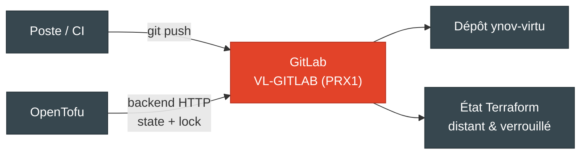
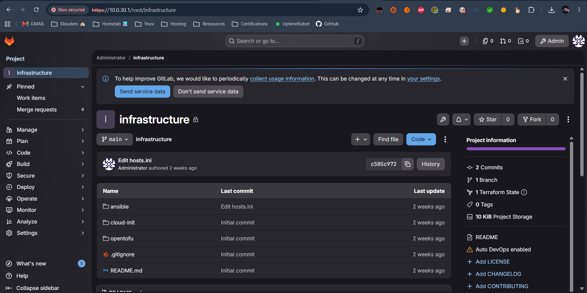

# GitLab

<div align="center">
  
</div>

## Présentation

La VM **`VL-GITLAB`** (nœud PRX1) héberge une instance **GitLab** qui joue deux rôles dans le lab :

1. **Remote Git du dépôt** - le projet `ynov-virtu` y est hébergé (ou mirroré depuis GitHub) ;
2. **Backend d'état Terraform** - GitLab stocke l'état **OpenTofu** via son [backend HTTP Terraform state](https://docs.gitlab.com/ee/user/infrastructure/iac/terraform_state.html), pour un état **distant et verrouillé** (travail en équipe / CI) plutôt que l'état local par défaut.





!!! info "Déployé hors IaC"
    Contrairement aux VMs de workload, GitLab n'est pas provisionné par ce dépôt (OpenTofu/Ansible) : c'est un service d'infrastructure du lab, déployé séparément.

---

## Backend d'état Terraform

Par défaut, l'état OpenTofu est **local** (`opentofu/backend.tf`). Le backend GitLab est fourni en commentaire, à décommenter et adapter pour basculer sur un état distant :

```hcl
terraform {
  backend "http" {
    address        = "https://<gitlab>/api/v4/projects/<PROJECT_ID>/terraform/state/proxmox-workshop"
    lock_address   = "https://<gitlab>/api/v4/projects/<PROJECT_ID>/terraform/state/proxmox-workshop/lock"
    unlock_address = "https://<gitlab>/api/v4/projects/<PROJECT_ID>/terraform/state/proxmox-workshop/lock"
    lock_method    = "POST"
    unlock_method  = "DELETE"
    retry_wait_min = 5
  }
}
```

Initialisation avec un jeton d'accès GitLab (username + Personal/Project Access Token, scope `api`) :

```bash
tofu init \
  -backend-config="username=<user>" \
  -backend-config="password=<gitlab_token>"
```

!!! tip "Avantage"
    L'état distant verrouillé évite les corruptions d'état en cas d'`apply` concurrents et permet de partager l'état entre les membres de l'équipe et une éventuelle CI.

---

## Voir aussi

- [Déploiement OpenTofu & cloud-init](opentofu.md) - provisionnement des VMs et `backend.tf`
- [Architecture](architecture.md) - place de GitLab dans le lab
