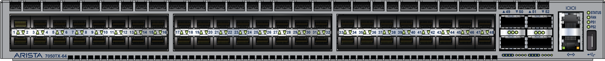

---
hide:
  - navigation
  - toc
---

# YNOV-VIRTU, un lab d'infrastructure virtualisée à Ynov !

<div align="center">
  
</div>

## Module **Virtualisation** (M1 Expert Cloud, Sécurité & Infrastructure)

Lab orienté entreprise basé sur **Proxmox VE** , **OPNsense** , **Ceph**  et un switch **Arista 7050TX-64** .  
Par-dessus cet underlay physique, une **couche workload** (bastion JumpServer, web, db, supervision Zabbix, IPAM NetBox) est déployée en IaC : **OpenTofu**  + **cloud-init** + **Ansible** .  
Le repo couvre toute la stack : documentation, configs réseau, IaC et **GitHub** Pages .

## L'Équipe sur ce lab

<div class="team-grid">
  <a class="team-member" href="https://github.com/astronas">
    <span class="team-avatar" data-initials="TG"></span>
    <span class="team-name">Thibaut Gianola</span>
    <span class="team-handle">@astronas</span>
  </a>
  <a class="team-member" href="https://github.com/Sorway">
    <span class="team-avatar" data-initials="JP"></span>
    <span class="team-name">Jonathan Panzer</span>
    <span class="team-handle">@Sorway</span>
  </a>
  <a class="team-member" href="https://github.com/Redouane638">
    <span class="team-avatar" data-initials="RK"></span>
    <span class="team-name">Redouane Kachour</span>
    <span class="team-handle">@Redouane638</span>
  </a>
  <a class="team-member" href="https://github.com/veysacha">
    <span class="team-avatar" data-initials="SV"></span>
    <span class="team-name">Sacha Veylon-Busser</span>
    <span class="team-handle">@veysacha</span>
  </a>
</div>


## Stack technique

<div class="tech-logos">
  
  
  
  
  
  
  
  
</div>

## Stack physique (assets)

<div class="figure-row" markdown>

<figure markdown>
  { style="height:120px;width:auto" }
  <figcaption><strong>Switch réseau</strong> - Arista 7050TX-64 <br>(48&times; RJ45 10G + 4&times; QSFP+ 40G SFP)</figcaption>
</figure>

<figure markdown>
  { style="height:260px;width:auto" }
  <figcaption><strong>Serveurs</strong> - 3&times; MSI MS-7D59 (PRX-1, PRX-2, PRX-3)</figcaption>
</figure>

</div>

## Quickstart

```bash
# 1. Cloner le repo
git clone https://github.com/astronas/ynov-virtu && cd ynov-virtu

# 2. Provisionner les VMs avec OpenTofu (clone du template cloud-init)
cd opentofu
cp terraform.tfvars.example terraform.tfvars   # API Proxmox, node, template, réseau
tofu init && tofu apply
cd ..

# 3. Installer les collections + rôle externe Ansible
cd ansible
ANSIBLE_CONFIG=./ansible.cfg ansible-galaxy collection install -r requirements.yml

# 4. Configurer les VMs (socle commun + rôles + services)
ansible-playbook playbooks/roles.yml
```

> Détails : [OpenTofu & cloud-init](opentofu.md) · [Configuration Ansible](ansible.md)