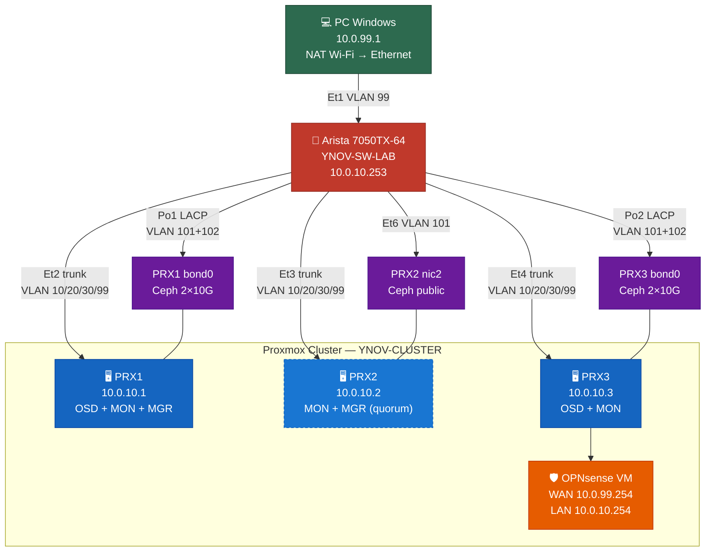
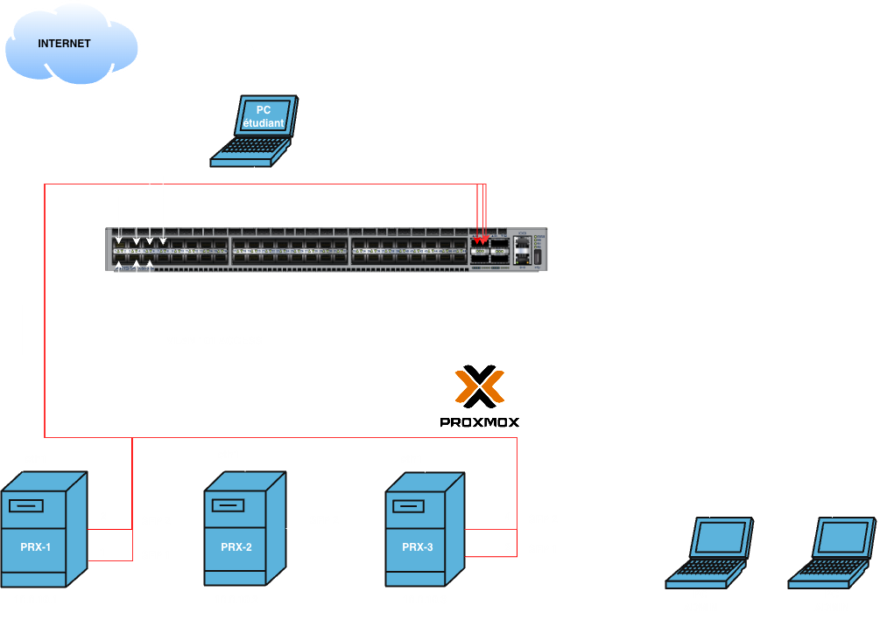

<div align="center">
  
</div>

# YNOV-VIRTU — Lab d'infrastructure virtualisée

> **Cours de Virtualisation** — M1 Expert Cloud, Sécurité & Infrastructure  
>  YNOV Campus Sophia-Antipolis

Lab orienté entreprise basé sur **Proxmox VE** , **OPNsense** , **Ceph**  et un switch **Arista 7050TX-64** .  
Par-dessus cet underlay physique, une **couche workload** (bastion JumpServer, web, db, supervision Zabbix) est déployée en IaC : **OpenTofu**  + **cloud-init** + **Ansible** .  
Le repo couvre toute la stack : documentation, configs réseau, IaC et **GitHub** Pages .

---

## Stack technique

<div class="tech-logos">
  
  
  
  
  
  
  
  
</div>

---

## Équipe

| Membre | GitHub |
|--------|--------|
| Jonathan Panzer | [@Sorway](https://github.com/Sorway) |
| Redouane Kachour | [@Redouane638](https://github.com/Redouane638) |
| Thibaut Gianola | [@astronas](https://github.com/astronas) |
| Sacha Veylon-Busser | [@veysacha](https://github.com/veysacha) |

---

## Stack physique (assets)

**Switch réseau** — Arista 7050TX-64  (48× RJ45 10G + 4× QSFP+ 40G SFP)


**Serveurs Proxmox** — 3× MSI MS-7D59 (PRX-1, PRX-2, PRX-3)

{ style="height:320px;width:auto" }

---

## Architecture



---

## Plan réseau

| VLAN | Nom | Réseau | Rôle |
|------|-----|--------|------|
| 10 | MGMT | 10.0.10.0/24 | Management — PRX1=.1, PRX2=.2, PRX3=.3, SW=.253, OPNsense=.254 |
| 20 | DMZ | 10.0.20.0/24 | reverse-proxy=.10 |
| 30 | SRV-LAN | 10.0.30.0/24 | VMs serveurs internes |
| 99 | WAN-OPNSENSE | 10.0.99.0/24 | PC Windows=.1, OPNsense WAN=.2 |
| 101 | CEPH-PUBLIC | 10.0.101.0/24 | PRX1=.1, PRX2=.2, PRX3=.3 |
| 102 | CEPH-PRIVATE | 10.0.102.0/24 | PRX1=.1, PRX3=.3 (PRX2 exclu) |
| 4094 | BLACKHOLE | — | VLAN natif des ports inutilisés + trunks Ceph |

---

## Couche workload (VMs)

| VM | Rôle | VLAN | IP |
|----|------|------|----|
| **bastion** | JumpServer (PAM) + outils d'admin | 20 — DMZ | `10.0.20.1` |
| **web** | Frontal nginx + php-fpm | 30 — SRV-LAN | `10.0.30.4` |
| **db** | Base de données MariaDB | 30 — SRV-LAN | `10.0.30.5` |
| **zabbix** | Supervision (serveur + web + MariaDB) | 30 — SRV-LAN | `10.0.30.6` |

---

## Quickstart

```bash
# 1. Cloner le repo
git clone https://github.com/astronas/ynov-virtu && cd ynov-virtu

# 2. Provisionner les VMs avec OpenTofu (clone du template cloud-init)
cd opentofu
cp terraform.tfvars.example terraform.tfvars   # API Proxmox, node, template, réseau
tofu init && tofu apply
cd ..

# 3. Installer les collections + rôle externe Ansible
cd ansible
ANSIBLE_CONFIG=./ansible.cfg ansible-galaxy collection install -r requirements.yml

# 4. Configurer les VMs (socle commun + rôles + services)
ansible-playbook playbooks/roles.yml
```

> Détails : [OpenTofu & cloud-init](opentofu.md) · [Configuration Ansible](ansible.md)

---

## Navigation

<div class="grid cards" markdown>

-   :material-sitemap:{ .lg .middle } **Architecture**

    ---

    Topologie complète, rôles des composants et décisions de design.

    [:octicons-arrow-right-24: Vue d'ensemble](architecture.md)

-   :material-ip-network:{ .lg .middle } **Plan réseau & VLANs**

    ---

    Adressage IP, VLANs et affectation des ports switch.

    [:octicons-arrow-right-24: Plan réseau](network-plan.md)

-   :material-server:{ .lg .middle } **Proxmox VE**

    ---

    Installation, cluster 3 nœuds, bridges et interfaces.

    [:octicons-arrow-right-24: Proxmox](proxmox.md)

-   :material-database:{ .lg .middle } **Ceph**

    ---

    Déploiement OSD / MON / MGR, pools et benchmarks.

    [:octicons-arrow-right-24: Ceph](ceph.md)

-   :material-shield-lock:{ .lg .middle } **OPNsense**

    ---

    VM, interfaces, firewall, NAT et DNS.

    [:octicons-arrow-right-24: OPNsense](opnsense.md)

-   :material-microsoft-windows:{ .lg .middle } **NAT Windows**

    ---

    Passerelle WAN Wi-Fi → Ethernet en PowerShell.

    [:octicons-arrow-right-24: NAT Windows](windows-nat.md)

-   :material-cloud-upload:{ .lg .middle } **OpenTofu & cloud-init**

    ---

    Provisionnement des VMs : template, provider, variables.

    [:octicons-arrow-right-24: OpenTofu](opentofu.md)

-   :material-cog-sync:{ .lg .middle } **Configuration Ansible**

    ---

    Socle, rôles, bastion JumpServer et supervision Zabbix.

    [:octicons-arrow-right-24: Ansible](ansible.md)

-   :material-lock-check:{ .lg .middle } **Sécurité**

    ---

    Politique inter-VLAN, VLAN 4094 blackhole, hardening.

    [:octicons-arrow-right-24: Sécurité](security.md)

-   :material-wrench:{ .lg .middle } **Dépannage**

    ---

    Problèmes rencontrés et résolutions.

    [:octicons-arrow-right-24: Dépannage](troubleshooting.md)

-   :material-lan-connect:{ .lg .middle } **Tests réseau**

    ---

    Matrice de validation réseau complète.

    [:octicons-arrow-right-24: Tests réseau](network-tests.md)

</div>

---

## Schéma de brassage


