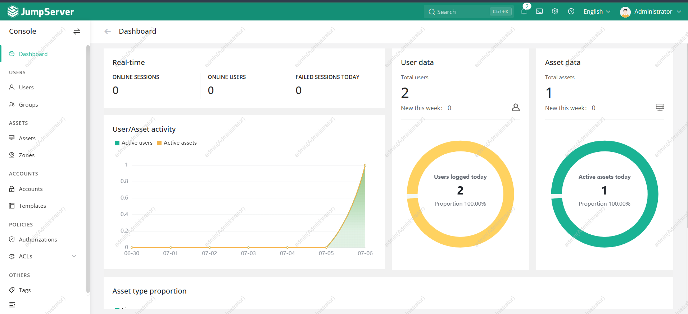
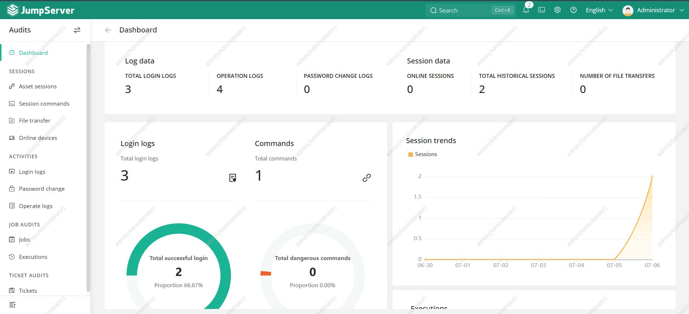

# Bastion JumpServer (PAM)

<div align="center">
  
</div>

## Présentation

Le point d'entrée d'administration du lab est un bastion **[JumpServer](https://www.jumpserver.org/)** (**Privileged Access Management**), déployé en conteneurs (docker compose v2) sur la VM `bastion` (`10.0.20.1`, VLAN 20 DMZ), version **`v4.10.16`**.

Il centralise et trace tous les accès privilégiés (SSH / RDP) vers les VMs internes : plutôt que de se connecter directement, un administrateur passe par le bastion, qui applique l'authentification, l'autorisation et l'**enregistrement des sessions**.



---

## Déploiement

Le déploiement est piloté par le rôle externe **[`astronas/jumpserver`](https://github.com/astronas/jumpserver)** (cloné dans `ansible/external/jumpserver/`, exposé via `roles_path`). Le play `bastion` applique dans l'ordre :

```yaml
roles:
  - bastion       # outils d'admin (nmap, tcpdump, mtr...)
  - docker        # Docker Engine + plugin Compose
  - jumpserver    # PAM conteneurisé (docker compose v2)
```

Les variables sont dans `group_vars/bastion.yml`.

---

## Conteneurs & ports

JumpServer orchestre plusieurs conteneurs (core applicatif + proxies de protocole + PostgreSQL et Redis embarqués) :

| Port | Service | Rôle |
|------|---------|------|
| `80` | Frontend web | Console d'administration JumpServer |
| `2222` | Proxy **KoKo** | Accès **SSH** aux actifs via le bastion |
| `3389` | Proxy **Lion** | Accès **RDP** aux actifs via le bastion |



---

## Secrets

Définis dans `group_vars/bastion.yml`, générés **une seule fois** (ne jamais les changer, sous peine de rendre illisibles les sessions et données chiffrées) :

| Variable | Rôle |
|----------|------|
| `jumpserver_secret_key` | Clé de chiffrement applicative (`openssl rand -hex 32`) |
| `jumpserver_bootstrap_token` | Jeton d'enrôlement des composants (`openssl rand -hex 16`) |
| `jumpserver_db_password` / `jumpserver_redis_password` | Conteneurs PostgreSQL / Redis embarqués |

!!! warning "Secrets à vaulter"
    Ces valeurs sont encore en clair dans `group_vars/bastion.yml`. À déplacer dans un `vault.yml` chiffré / [Vault](vault.md).

---

## Flux d'accès


---

## Voir aussi

- [Configuration Ansible](ansible.md) - rôle `jumpserver` et dépendances
- [Sécurité](security.md) - politique d'accès et durcissement
- [Vault](vault.md) - centralisation des secrets
