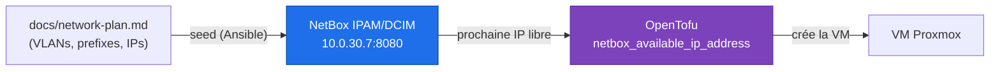
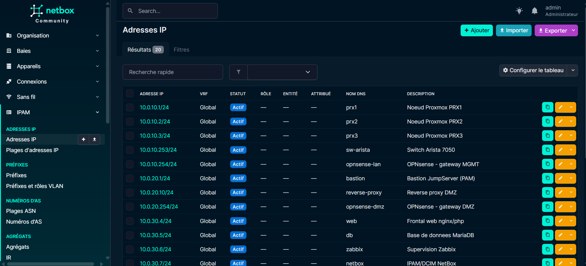
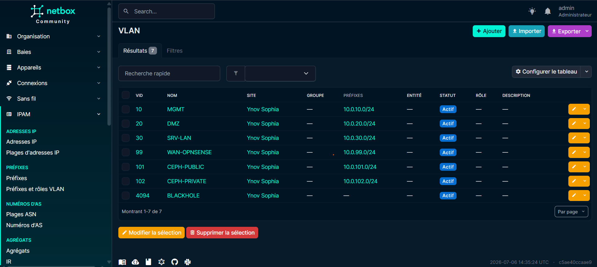

#  NetBox (IPAM / DCIM)

<div align="center">
  
</div>

## Présentation

**NetBox** est la **source de vérité réseau** du lab (*IP Address Management* / *Data Center Infrastructure Management*). Il est déployé en conteneurs (docker compose v2, via **netbox-docker**) sur la VM `netbox` (`10.0.30.7`, VLAN 30 SRV-LAN), et alimente **OpenTofu** pour l'allocation d'adresses IP.







---

## Déploiement (rôle `netbox`)

Le rôle Ansible `netbox` clone le dépôt **netbox-docker** à une version épinglée, dépose les fichiers `env/*.env` et un `docker-compose.override.yml` (templatés depuis `group_vars/netbox.yml`), puis lance `docker compose up -d`.

| Conteneur | Rôle |
|-----------|------|
| `netbox` / `netbox-worker` / `netbox-housekeeping` | Application NetBox (gunicorn + tâches asynchrones) |
| `postgres` | Base de données PostgreSQL |
| `redis` / `redis-cache` | File d'attente + cache |

Détails et mécanique du rôle : [Configuration Ansible](ansible.md#netbox-ipam-dcim).

---

## Peuplement de l'IPAM

Le playbook `playbooks/netbox-seed.yml` peuple NetBox à partir du plan réseau documenté (`playbooks/vars/netbox_ipam.yml`, transcrit depuis [docs/network-plan.md](network-plan.md)) : **site**, **VLANs**, **préfixes** et **IP statiques** réservées, de façon idempotente.

```bash
pipx inject ansible pynetbox
ansible-galaxy collection install -r requirements.yml
ansible-playbook playbooks/netbox-seed.yml
```

---

## Allocateur d'IP pour OpenTofu

Une fois l'IPAM peuplé, OpenTofu **délègue l'attribution des IP** à NetBox : une VM sans `ip` statique mais avec un `prefix` reçoit la prochaine adresse libre (`netbox_available_ip_address`). Voir [OpenTofu - NetBox comme allocateur d'IP](opentofu.md#netbox-comme-allocateur-dip).

---

## Accès

| Élément | Valeur |
|---------|--------|
| Frontend | **`http://10.0.30.7:8080/`** |
| Compte initial | `SUPERUSER_NAME` / `SUPERUSER_PASSWORD` (`group_vars/netbox.yml`) |

L'hôte `netbox` est supervisé par un [agent Zabbix](supervision.md).

!!! warning "Secrets"
    `SECRET_KEY`, mots de passe DB/Redis et token API sont encore des placeholders `CHANGE_ME` dans `group_vars/netbox.yml`. À migrer vers [Vault](vault.md).

---

## Voir aussi

- [Configuration Ansible](ansible.md#netbox-ipam-dcim) - rôle `netbox` et seed
- [OpenTofu & cloud-init](opentofu.md#netbox-comme-allocateur-dip) - allocateur d'IP
- [Plan réseau & VLANs](network-plan.md) - source des données IPAM
