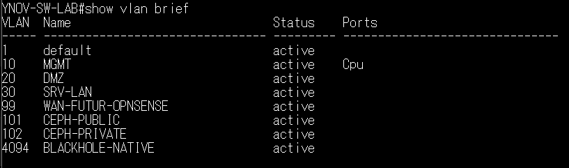

# Plan réseau - VLANs, IPs et ports switch

## VLANs

| VLAN | Nom | Réseau | Masque | Gateway (OPNsense) | Rôle |
|---|---|---|---|---|---|
| **10** | MGMT | `10.0.10.0` | `/24` | `10.0.10.254` | Management Proxmox, switch, OPNsense LAN |
| **20** | DMZ | `10.0.20.0` | `/24` | `10.0.20.254` | Zone DMZ - reverse proxy, services exposés |
| **30** | SRV-LAN | `10.0.30.0` | `/24` | `10.0.30.254` | Services internes, VMs métier |
| **99** | WAN-OPNSENSE | `10.0.99.0` | `/24` | `10.0.99.1` (PC Win) | WAN OPNsense via NAT Windows |
| **101** | CEPH-PUBLIC | `10.0.101.0` | `/24` | - | Accès client Ceph, MON/MGR |
| **102** | CEPH-PRIVATE | `10.0.102.0` | `/24` | - | Réplication OSD Ceph (PRX1 ↔ PRX3) |
| **4094** | BLACKHOLE | - | - | - | VLAN poubelle / native sécurisée |



---

## Plan IP complet

### VLAN 10 - MGMT (`10.0.10.0/24`)

| Équipement | Adresse IP | Remarques |
|---|---|---|
| PRX1 | `10.0.10.1/24` | Interface `vmbr0` non tagué (natif) |
| PRX2 | `10.0.10.2/24` | Interface `vmbr0` non tagué (natif) |
| PRX3 | `10.0.10.3/24` | Interface `vmbr0` non tagué (natif) |
| Switch Arista | `10.0.10.253/24` | Interface VLAN 10 du switch |
| OPNsense LAN/MGMT | `10.0.10.254/24` | Gateway du VLAN MGMT |
| PC Admin | DHCP ou statique | Branché sur Et5 ou Et7, access VLAN 10 |

### VLAN 20 - DMZ (`10.0.20.0/24`)

| Équipement | Adresse IP | Remarques |
|---|---|---|
| OPNsense DMZ | `10.0.20.254/24` | Gateway de la DMZ |
| Reverse proxy | `10.0.20.10/24` | NGINX, Traefik ou Caddy |

### VLAN 30 - SRV/LAN (`10.0.30.0/24`)

| Équipement | Adresse IP | Remarques |
|---|---|---|
| OPNsense SRV/LAN | `10.0.30.254/24` | Gateway des services internes |
| VMs métier | `10.0.30.x/24` | Attribution libre, DHCP via OPNsense possible |

### VLAN 99 - WAN OPNsense (`10.0.99.0/24`)

| Équipement | Adresse IP | Remarques |
|---|---|---|
| PC Windows (NAT) | `10.0.99.1/24` | Carte Ethernet vers switch, pas de gateway |
| OPNsense WAN | `10.0.99.254/24` | Gateway : `10.0.99.1` |

### VLAN 101 - Ceph public (`10.0.101.0/24`)

| Équipement | Adresse IP | Remarques |
|---|---|---|
| PRX1 | `10.0.101.1/24` | Interface `bond0.101` (LACP Po1) |
| PRX2 | `10.0.101.2/24` | Interface `nic2` (Et6, SFP→RJ45) |
| PRX3 | `10.0.101.3/24` | Interface `bond0.101` (LACP Po2) |

### VLAN 102 - Ceph private (`10.0.102.0/24`)

| Équipement | Adresse IP | Remarques |
|---|---|---|
| PRX1 | `10.0.102.1/24` | Interface `bond0.102` (LACP Po1) |
| PRX3 | `10.0.102.3/24` | Interface `bond0.102` (LACP Po2) |

> PRX2 n'a pas d'adresse sur VLAN 102 : il ne porte pas d'OSD et ne participe pas à la réplication.

---

##  Rôles des ports switch Arista

| Port | Mode | VLAN(s) | Équipement connecté | Remarques |
|---|---|---|---|---|
| `Ethernet1` | Access | 99 | PC Windows | WAN OPNsense |
| `Ethernet2` | Trunk | 10 (natif), 20, 30, 99 | PRX1 | nic0 / vmbr0 |
| `Ethernet3` | Trunk | 10 (natif), 20, 30, 99 | PRX2 | nic0 / vmbr0 |
| `Ethernet4` | Trunk | 10 (natif), 20, 30, 99 | PRX3 | nic0 / vmbr0 |
| `Ethernet5` | Access | 10 | PC Admin | Administration directe |
| `Ethernet6` | Access | 101 | PRX2 nic2 (SFP→RJ45) | Ceph public PRX2 uniquement |
| `Ethernet7` | Access | 10 | PC Admin 2 | Second poste d'administration |
| `Ethernet8-48` | Access | 4094 | - | Ports inutilisés, **shutdown** |
| `Ethernet49/1` | - | - | PRX1 SFP lien 1 | Membre de Po1 |
| `Ethernet49/2` | - | - | PRX1 SFP lien 2 | Membre de Po1 |
| `Ethernet49/3` | - | - | PRX3 SFP lien 1 | Membre de Po2 |
| `Ethernet49/4` | - | - | PRX3 SFP lien 2 | Membre de Po2 |
| `Port-Channel1` | Trunk | 101, 102 (natif 4094) | PRX1 Ceph | LACP 2×10G |
| `Port-Channel2` | Trunk | 101, 102 (natif 4094) | PRX3 Ceph | LACP 2×10G |

---

##  Logique de trunking Proxmox

Les ports `Et2`, `Et3`, `Et4` sont configurés en trunk avec VLAN natif 10. Côté Proxmox, `vmbr0` est VLAN-aware et supporte les VLAN IDs 10, 20, 30 et 99.

```
Switch Et2/3/4 (trunk, native VLAN 10)
         │
      vmbr0 (bridge VLAN-aware, bridge-vids 10 20 30 99)
         │
   ┌─────┴──────┐
   │   VMs      │
   │ tag vide   │→ VLAN 10 (MGMT, trafic natif)
   │ tag 20     │→ VLAN 20 (DMZ)
   │ tag 30     │→ VLAN 30 (SRV/LAN)
   │ tag 99     │→ VLAN 99 (WAN OPNsense)
   └────────────┘
```

---

##  Logique de trunking Ceph

Les Port-Channels 1 et 2 transportent les VLANs 101 et 102. Le VLAN natif est 4094 (blackhole), ce qui garantit qu'aucun trafic non tagué ne circule accidentellement sur ces liens.

```
Switch Po1 (trunk, VLANs 101+102, native 4094)
         │
      bond0 (LACP) sur PRX1
         │
   ┌─────┴──────┐
   │ bond0.101  │→ 10.0.101.1/24 (Ceph public)
   │ bond0.102  │→ 10.0.102.1/24 (Ceph private)
   └────────────┘
```


---

## Plages d'adresses réservées

| Plage | Usage |
|---|---|
| `10.0.10.1-10` | Nœuds Proxmox et infrastructure |
| `10.0.10.100-200` | VMs management (DHCP ou statique) |
| `10.0.10.253-254` | Switch et OPNsense (fixes) |
| `10.0.20.1-10` | VMs DMZ fixes (reverse proxy) |
| `10.0.20.100-200` | VMs DMZ dynamiques |
| `10.0.30.100-200` | VMs SRV/LAN (DHCP via OPNsense) |
| `10.0.99.1-2` | PC Windows et OPNsense WAN (fixes) |
| `10.0.101.1-3` | Nœuds Ceph public (fixes) |
| `10.0.102.1-3` | Nœuds Ceph private (fixes, PRX1+PRX3 seulement) |

---

## Voir aussi

- [docs/architecture.md](architecture.md) - Vue d'ensemble
- [configs/arista/running-config-current.eos](../configs/arista/running-config-current.eos) - Configuration switch
- [diagrams/vlan-flow.mmd](../diagrams/vlan-flow.mmd) - Flux inter-VLAN
