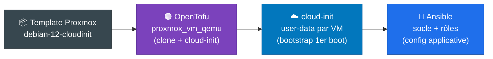

# Déploiement OpenTofu & cloud-init

## Présentation

Le provisionnement des **VMs de workload** repose sur l'**Infrastructure as Code** :
 **OpenTofu** clone un template
Debian compatible cloud-init sur le cluster Proxmox ,
**cloud-init** réalise le bootstrap au premier boot, puis
 **Ansible** applique la configuration
applicative complète (voir [Configuration Ansible](ansible.md)).



!!! info "Deux couches distinctes"
    L'**infra physique** (Proxmox, Ceph, Arista, OPNsense - voir [Architecture](architecture.md)) est
    l'**underlay**. Les VMs décrites ici sont la **couche workload** déployée par-dessus, sur les
    VLANs 20 (DMZ) et 30 (SRV-LAN) définis dans le [plan réseau](network-plan.md).

---

## VMs déployées

| VM | Rôle | VLAN | IP | vCPU | RAM | Disque |
|----|------|------|----|------|-----|--------|
| **bastion** | JumpServer (PAM) + outils d'admin | 20 - DMZ | `10.0.20.1` | 1 | 1 Go | 16 Go |
| **web** | Frontal nginx + php-fpm | 30 - SRV-LAN | `10.0.30.4` | 2 | 2 Go | 20 Go |
| **db** | Base de données MariaDB | 30 - SRV-LAN | `10.0.30.5` | 2 | 2 Go | 24 Go |
| **zabbix** | Supervision (serveur + web + MariaDB) | 30 - SRV-LAN | `10.0.30.6` | 2 | 3 Go | 24 Go |
| **netbox** | IPAM/DCIM NetBox (docker compose) | 30 - SRV-LAN | `10.0.30.7` | 2 | 4 Go | 30 Go |

!!! note "Dimensionnement vs adressage"
    Le **dimensionnement** (vCPU / RAM / disque) provient des valeurs par défaut de
    `opentofu/variables.tf` (variable `vms`). L'**adressage** (IP / VLAN / passerelle) est défini
    dans `terraform.tfvars` selon le [plan réseau](network-plan.md) du lab - les valeurs d'exemple
    de `variables.tf` (`192.168.10.x`) sont des placeholders à surcharger.

---

## Arborescence

```
opentofu/
├── providers.tf              # Providers Telmate/proxmox + e-breuninger/netbox
├── backend.tf                # Backend local (HTTP GitLab en option, commenté)
├── variables.tf              # Variables + définition par défaut des 5 VMs (var.vms)
├── main.tf                   # Ressource proxmox_vm_qemu (for_each var.vms)
├── outputs.tf                # vm_ips + ssh_commands
└── terraform.tfvars.example  # Modèle de variables (à copier en terraform.tfvars)
```

---

## Provider & authentification

`providers.tf` épingle le provider **Telmate/proxmox `3.0.2-rc07`** et supporte deux modes
d'authentification (token API recommandé) :

```hcl
provider "proxmox" {
  pm_api_url          = var.proxmox_api_url
  pm_api_token_id     = var.proxmox_api_token_id      # ex: terraform-prov@pve!terraform
  pm_api_token_secret = var.proxmox_api_token_secret
  pm_user             = var.proxmox_user              # alternative: root@pam
  pm_password         = var.proxmox_password
  pm_tls_insecure     = var.proxmox_tls_insecure      # certificat auto-signé Proxmox
  pm_parallel         = 1
}
```

!!! warning "Secrets"
    Les tokens / mots de passe Proxmox ne doivent **jamais** être commités. Renseigne-les dans
    `terraform.tfvars` (ignoré par git) ou via des variables d'environnement `TF_VAR_*`.

---

## Définition des VMs

Chaque VM est un clone complet du template, configuré via cloud-init par le provider
(`main.tf`, `for_each = var.vms`) :

```hcl
resource "proxmox_vm_qemu" "vm" {
  for_each = var.vms

  name        = each.value.hostname
  target_node = var.target_node
  clone       = var.template_name      # template Debian cloud-init
  full_clone  = true
  os_type     = "cloud-init"
  agent       = 1                       # qemu-guest-agent

  memory = each.value.memory
  cpu { cores = each.value.cores, sockets = 1, type = "host" }

  ciuser     = var.ci_user
  cipassword = var.ci_password
  ipconfig0  = "ip=${local.vm_ip_cidr[each.key]},gw=${var.gateway}" # statique ou alloue par NetBox
  nameserver = local.dns_nameserver
  searchdomain = var.search_domain

  network { id = 0, model = "virtio", bridge = var.bridge,
            tag = coalesce(each.value.vlan_id, var.vlan_id), firewall = true }

  disk { type = "disk", slot = "scsi1", storage = var.storage,
         size = each.value.disk_size, discard = true, emulatessd = true }
}
```

Variables principales (`variables.tf`) :

| Variable | Rôle | Défaut |
|----------|------|--------|
| `target_node` | Nœud Proxmox hôte | - |
| `template_name` | Template cloud-init à cloner | - |
| `storage` | Stockage des disques | `local-lvm` |
| `bridge` | Bridge réseau (`net0`) | `vmbr0` |
| `vlan_id` | Tag VLAN par défaut | `null` |
| `gateway` | Passerelle IPv4 | - |
| `dns_servers` | Résolveurs DNS | `1.1.1.1`, `8.8.8.8` |
| `search_domain` | Domaine de recherche | `lab.local` |
| `ci_user` | Utilisateur cloud-init | `admin` |
| `netbox_url` | URL de l'API NetBox (allocation d'IP) | - |
| `netbox_api_token` | Token API NetBox | - |
| `vms` | Map des VMs (hostname, ip *ou* prefix, cidr, vlan, cores, memory, disk, role) | 5 VMs |

---

## NetBox comme allocateur d'IP

Depuis l'ajout de NetBox (IPAM), OpenTofu peut **déléguer l'attribution des IP** au lieu de les coder en dur. Une VM sans champ `ip` mais avec un `prefix` reçoit la **prochaine adresse libre** de ce préfixe :

```hcl
data "netbox_prefix" "vm" {
  for_each = { for k, v in var.vms : k => v if v.ip == null }
  prefix   = each.value.prefix
}

resource "netbox_available_ip_address" "vm" {
  for_each  = { for k, v in var.vms : k => v if v.ip == null }
  prefix_id = data.netbox_prefix.vm[each.key].id
  status    = "active"
  dns_name  = "${each.value.hostname}.${var.search_domain}"
}
```

Les VMs avec `ip` renseignée restent **statiques** (ex : la VM `netbox` elle-même, pour éviter une dépendance circulaire tofu vers NetBox). Le provider `e-breuninger/netbox` est configuré dans `providers.tf` avec `var.netbox_url` et `var.netbox_api_token`.

!!! warning "Ordre de déploiement"
    NetBox doit être **déployé et peuplé** (voir [Configuration Ansible](ansible.md), playbook `netbox-seed.yml`) avant que l'allocateur ne puisse distribuer des IP. La VM qui héberge NetBox garde donc une IP statique.

---

## cloud-init (bootstrap)

`cloud-init/` contient un fichier `#cloud-config` par VM. Il assure un **bootstrap minimal** au
premier boot (hostname, mise à jour des paquets, `qemu-guest-agent` + paquets de base du rôle) ;
la configuration applicative complète est ensuite déléguée à [Ansible](ansible.md).

| Fichier | Paquets installés au boot |
|---------|---------------------------|
| `bastion-user-data.yaml` | qemu-guest-agent, curl, vim, git, rsync, net-tools, dnsutils, htop |
| `web-user-data.yaml` | qemu-guest-agent, nginx, php-fpm, php-mysql, php-cli |
| `db-user-data.yaml` | qemu-guest-agent, mariadb-server, mariadb-client |
| `zabbix-user-data.yaml` | qemu-guest-agent, curl, gnupg, nginx, php-fpm, mariadb-client |
| `netbox-user-data.yaml` | qemu-guest-agent, curl, git (Docker + NetBox installés par Ansible) |

---

## Backend d'état

Par défaut, l'état OpenTofu est **local** (`backend.tf`). Un backend HTTP **GitLab** est fourni en
commentaire pour un état distant verrouillé (équipe / CI) :

```hcl
# terraform {
#   backend "http" {
#     address      = "https://gitlab.example.com/api/v4/projects/<ID>/terraform/state/proxmox-workshop"
#     lock_address = ".../lock"
#     lock_method  = "POST"
#     unlock_method = "DELETE"
#   }
# }
```

---

## Outputs

```hcl
vm_ips        # { bastion = "10.0.20.1", web = "10.0.30.4", ... }
ssh_commands  # { bastion = "ssh admin@10.0.20.1", ... }
```

---

## Quickstart

!!! note "Prérequis"
    Un **template Proxmox Debian 12 compatible cloud-init** doit exister sur le nœud cible
    (nom = `template_name`), ainsi qu'un **token API** Proxmox avec droits de clonage.

```bash
cd opentofu
cp terraform.tfvars.example terraform.tfvars   # renseigner API, node, template, réseau

tofu init
tofu plan -out=plan.tofu
tofu apply plan.tofu

tofu output ssh_commands                        # commandes SSH vers les VMs
```

> La configuration est validée en CI (`tofu fmt`/`init`/`validate`) via
> `.github/workflows/opentofu-validate.yml` à chaque PR touchant `opentofu/`.

---

## Voir aussi

- [Configuration Ansible](ansible.md) - configuration applicative des VMs après provisioning
- [Plan réseau & VLANs](network-plan.md) - adressage DMZ / SRV-LAN
- [Architecture](architecture.md) - underlay physique Proxmox / Ceph / OPNsense

