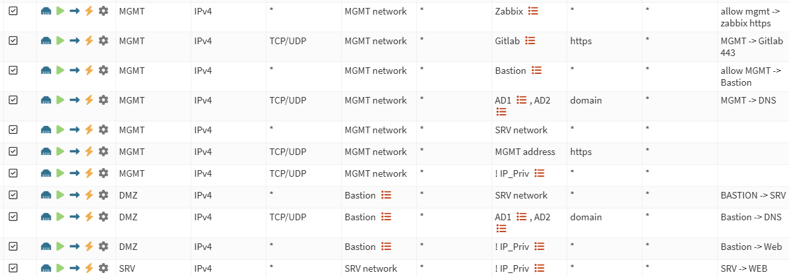
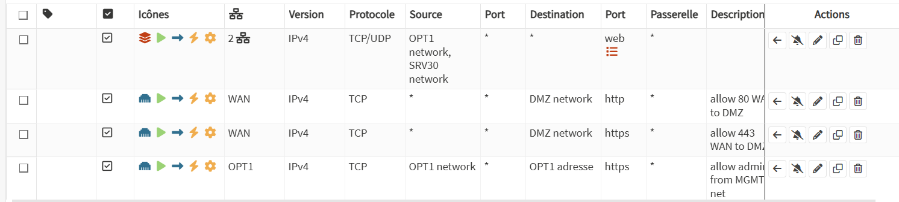

#  OPNsense — Pare-feu et routage inter-VLAN

## Présentation

OPNsense  est déployé en VM sur **PRX3** . Il joue le rôle de :

- **Routeur inter-VLAN** entre MGMT, DMZ, SRV/LAN et WAN.
- **Pare-feu stateful** contrôlant les flux entre segments.
- **Gateway WAN** vers Internet via le NAT Windows.
- **Serveur DHCP** optionnel pour les VLANs (recommandé pour VLAN 30).
- **Serveur DNS** (Unbound) pour les VMs internes.

---

## Création de la VM OPNsense sur PRX3

### Paramètres VM

| Paramètre | Valeur |
|---|---|
| Nom | `opnsense` |
| Nœud | PRX3 |
| OS | FreeBSD 14 (sélectionner lors de la création) |
| CPU | 2 vCPU |
| RAM | 2 Go minimum (4 Go recommandé) |
| Disque | 20 Go, stockage local Proxmox |
| ISO | OPNsense amd64 dvd (télécharger depuis opnsense.org) |

### Interfaces réseau de la VM

| Interface VM | Bridge | VLAN tag | Rôle OPNsense |
|---|---|---|---|
| `net0` (vtnet0) | `vmbr0` | `99` | WAN |
| `net1` (vtnet1) | `vmbr0` | *(vide)* | LAN / MGMT |
| `net2` (vtnet2) | `vmbr0` | `20` | DMZ |
| `net3` (vtnet3) | `vmbr0` | `30` | SRV/LAN |

> `net1` sans VLAN tag = trafic natif VLAN 10 (MGMT). Le switch livre le trafic VLAN 10 non tagué vers Proxmox (native VLAN).

---

## Configuration initiale OPNsense

### 1. Démarrer l'installation

Démarrer la VM depuis l'ISO OPNsense. L'installeur installe le système sur le disque de la VM.

### 2. Attribution des interfaces (console)

Au premier démarrage, OPNsense propose d'assigner les interfaces :

```
WAN  → vtnet0  (VLAN 99 — trafic tagué 99 par Proxmox)
LAN  → vtnet1  (VLAN 10 — trafic natif, non tagué)
OPT1 → vtnet2  (VLAN 20 — DMZ)
OPT2 → vtnet3  (VLAN 30 — SRV/LAN)
```

### 3. Configuration IP initiale (console)

**WAN (vtnet0)** :

```
IPv4 static : 10.0.99.254/24
Gateway     : 10.0.99.1
IPv6        : none
```

**LAN (vtnet1)** :

```
IPv4 static : 10.0.10.254/24
IPv6        : none
```

**OPT1 → renommer en DMZ (vtnet2)** :

```
IPv4 static : 10.0.20.254/24
IPv6        : none
```

**OPT2 → renommer en SRV (vtnet3)** :

```
IPv4 static : 10.0.30.254/24
IPv6        : none
```

---

## Configuration via l'interface Web

Accéder à l'interface web depuis un PC branché en VLAN 10 :

```
https://10.0.10.254
```

Identifiants par défaut : `admin` / `opnsense`

### Désactiver les blocages WAN privés

**Interfaces → WAN** :

- ☐ **Block private networks** → désactiver
- ☐ **Block bogon networks** → désactiver

> Indispensable car le WAN OPNsense est une IP privée (`10.0.99.254`).

### Renommer les interfaces

**Interfaces → OPT1** → renommer en `DMZ`
**Interfaces → OPT2** → renommer en `SRV`

### Configurer la gateway WAN

**System → Gateways → Add** :

| Champ | Valeur |
|---|---|
| Interface | WAN |
| Address Family | IPv4 |
| IP | `10.0.99.1` |
| Name | `GW_WAN` |
| Monitor IP | `1.1.1.1` |

---

## Règles firewall

### Capture des règles en production





### Tableau récapitulatif des règles actives

| # | Interface | Version | Protocole | Source | Port src | Destination | Port dst | Description |
|---|-----------|---------|-----------|--------|----------|-------------|----------|-------------|
| 1 | OPT1 + SRV30 | IPv4 | TCP/UDP | OPT1 network, SRV30 network | * | * | web | — |
| 2 | WAN | IPv4 | TCP | * | * | DMZ network | 80 (http) | allow 80 WAN to DMZ |
| 3 | WAN | IPv4 | TCP | * | * | DMZ network | 443 (https) | allow 443 WAN to DMZ |
| 4 | OPT1 | IPv4 | TCP | OPT1 network | * | OPT1 adresse | 443 (https) | allow admin from MGMT net |

> **OPT1** = VLAN 10 MGMT · **SRV30** = VLAN 30 SRV/LAN · **DMZ** = VLAN 20

### Logique de filtrage inter-VLAN

| Interface source | Destination | Action | Commentaire |
|---|---|---|---|
| MGMT (OPT1) + SRV30 | Internet (web) | Pass | Accès web sortant depuis management et serveurs |
| WAN | DMZ :80 | Pass | Exposition HTTP vers la DMZ |
| WAN | DMZ :443 | Pass | Exposition HTTPS vers la DMZ |
| MGMT (OPT1) | OPNsense :443 | Pass | Accès interface d'admin depuis le réseau MGMT |
| WAN | tout autre | Block | Entrant WAN bloqué par défaut (implicit deny) |
| DMZ | MGMT/SRV | Block | La DMZ n'initie pas vers l'interne |

---

## DHCP (optionnel)

### Activer DHCP sur VLAN 30 (SRV/LAN)

**Services → DHCPv4 → SRV** :

| Champ | Valeur |
|---|---|
| Enable | ✅ |
| Range From | `10.0.30.100` |
| Range To | `10.0.30.200` |
| Gateway | `10.0.30.254` |
| DNS | `10.0.30.254` (Unbound local) |

---

## DNS (Unbound)

**Services → Unbound DNS → General** :

- ✅ Enable
- **Network Interfaces** : LAN, DMZ, SRV (écoute sur les interfaces internes)
- **Outgoing Network Interfaces** : WAN

Ajouter des entrées DNS locales pour les équipements du lab :

**Services → Unbound DNS → Host Overrides** :

| Host | Domain | IP |
|---|---|---|
| prx1 | ynov.lab | 10.0.10.1 |
| prx2 | ynov.lab | 10.0.10.2 |
| prx3 | ynov.lab | 10.0.10.3 |
| switch | ynov.lab | 10.0.10.253 |

---

## Outbound NAT

**Firewall → NAT → Outbound** → mode Automatic ou Manual.

En mode automatique, OPNsense génère une règle pour chaque réseau interne vers le WAN :

```
Source : 10.0.10.0/24 → WAN (MASQUERADE)
Source : 10.0.20.0/24 → WAN (MASQUERADE)
Source : 10.0.30.0/24 → WAN (MASQUERADE)
```

---

## Commandes de diagnostic OPNsense (shell)

Accès SSH sur `10.0.10.254` (activer dans **System → Settings → Administration → SSH**) :

```bash
# Vérifier les interfaces
ifconfig

# Table de routage
netstat -rn

# Test DNS
host google.com

# Ping depuis OPNsense vers Internet
ping -c 4 1.1.1.1

# Ping vers les nœuds Proxmox
ping 10.0.10.1
ping 10.0.10.2
ping 10.0.10.3

# Logs firewall
clog /var/log/filter.log

# Traceroute
traceroute 1.1.1.1
```

---

## Voir aussi

- [configs/opnsense/interfaces.md](../configs/opnsense/interfaces.md) — Tableau des interfaces
- [configs/opnsense/firewall-rules.md](../configs/opnsense/firewall-rules.md) — Règles firewall
- [configs/opnsense/nat.md](../configs/opnsense/nat.md) — Outbound NAT
- [docs/windows-nat.md](windows-nat.md) — Configuration du NAT Windows (WAN)
