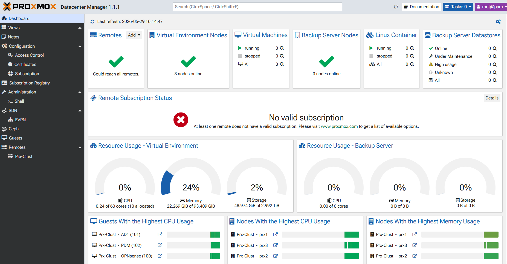
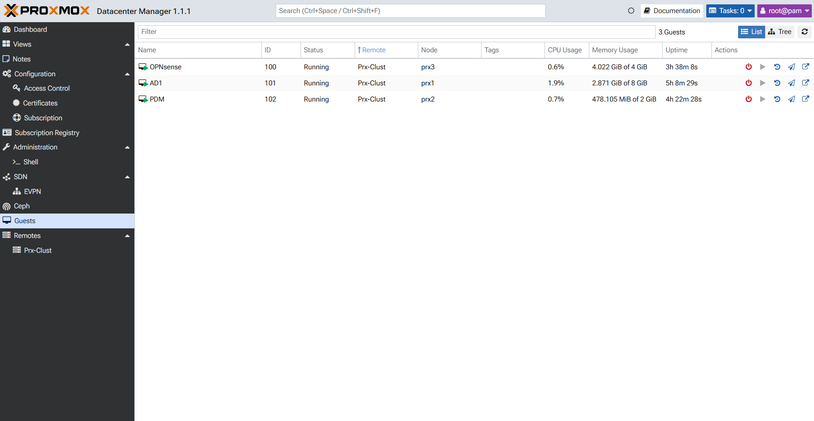

#  Proxmox VE — Configuration des nœuds

## Identification du matériel

Ces trois PC MSI constituent les **nœuds du cluster Proxmox VE**.

| Élément | Serveur 1 | Serveur 2 | Serveur 3 |
|---|---|---|---|
| **Désignation retenue** | PRX-1 | PRX-2 | PRX-3 |
| **Marque** | MSI | MSI | MSI |
| **Modèle** | MS-7D59 | MS-7D59 | MS-7D59 |
| **Numéro de série** | 022X2210036417 | 022X2210036398 | 022X2210036399 |
| **Étiquette visible** | D-3D-SOP1FR-023 | D-3D-SOP1FR-022 | D-3D-SOP1FR-099 |
| **RAM** | 32 Go | 32 Go | 32 Go |
| **SSD (système)** | 512 Go (~256 Go utilisables) | 512 Go (~256 Go utilisables) | 512 Go (~256 Go utilisables) |
| **HDD (données / OSD Ceph)** | 1,8 To | 1,8 To | 1,8 To |

---

## Prérequis

- ISO Proxmox VE 8.x téléchargé sur chaque serveur
- Accès console physique ou IPMI pour l'installation initiale
- Switch Arista configuré avant de démarrer l'installation (voir [configs/arista/](../configs/arista/))
- Plan IP respecté : PRX1=`10.0.10.1`, PRX2=`10.0.10.2`, PRX3=`10.0.10.3`

---

## Installation initiale

### Sur chaque nœud (PRX1, PRX2, PRX3)

1. Démarrer l'installation Proxmox VE depuis l'ISO.
2. Choisir le disque système (distinct des disques OSD Ceph).
3. Configurer le réseau lors de l'installation :
   - **PRX1** : IP `10.0.10.1/24`, gateway `10.0.10.254`, DNS `10.0.10.254` (OPNsense)
   - **PRX2** : IP `10.0.10.2/24`, gateway `10.0.10.254`, DNS `10.0.10.254`
   - **PRX3** : IP `10.0.10.3/24`, gateway `10.0.10.254`, DNS `10.0.10.254`
4. Hostname :
   - PRX1 : `prx1.ynov.lab`
   - PRX2 : `prx2.ynov.lab`
   - PRX3 : `prx3.ynov.lab`

> **Note** : OPNsense doit être opérationnel avant que les nœuds aient accès à Internet. Pour l'installation initiale, le NAT Windows suffit comme gateway.

---

## Configuration des interfaces réseau

Après installation, remplacer `/etc/network/interfaces` par l'exemple correspondant :

```bash
# Sauvegarder la config actuelle
cp /etc/network/interfaces /etc/network/interfaces.bak

# Appliquer la nouvelle config (exemple pour PRX1)
cp /path/to/prx1-interfaces.example /etc/network/interfaces

# Recharger la configuration réseau
ifreload -a

# Vérifier
ip addr show
ip route show
```

Les exemples de configuration se trouvent dans [configs/proxmox/](../configs/proxmox/).

---

## Structure des bridges Proxmox

### `vmbr0` — Bridge principal VLAN-aware

Présent sur les trois nœuds. Raccordé à l'interface physique principale (nic0).

```
vmbr0 (bridge-vlan-aware yes, bridge-vids 10 20 30 99)
  └── nic0 → switch trunk (native VLAN 10)
```

**Comportement :**
- Trafic non tagué sur `vmbr0` → VLAN 10 (MGMT natif)
- Trafic tagué VLAN 20 → DMZ
- Trafic tagué VLAN 30 → SRV/LAN
- Trafic tagué VLAN 99 → WAN OPNsense

### `bond0` — Bond LACP  Ceph (PRX1 et PRX3 uniquement)

Agrège deux interfaces SFP en LACP 802.3ad vers le switch.

```
bond0 (LACP 802.3ad)
  ├── enic1 → Et49/1 (PRX1) ou Et49/3 (PRX3)
  └── enic2 → Et49/2 (PRX1) ou Et49/4 (PRX3)
       ├── bond0.101 → Ceph public (VLAN 101)
       └── bond0.102 → Ceph private (VLAN 102)
```

### `nic2` — Interface Ceph public PRX2

Interface SFP→RJ45 directe, sans bond, sans VLAN tag (port access VLAN 101 côté switch).

---

## Création du cluster Proxmox

### 1. Créer le cluster sur PRX1

```bash
pvecm create YNOV-CLUSTER
```

Vérifier :

```bash
pvecm status
```

### 2. Joindre PRX2 et PRX3

Depuis chaque nœud à joindre :

```bash
pvecm add 10.0.10.1
```

> Le mot de passe root de PRX1 sera demandé.

### 3. Vérifier l'état du cluster

```bash
pvecm nodes
pvecm status
```

### 4. Vérifier la communication corosync

Corosync utilise le réseau MGMT (VLAN 10, adresses `10.0.10.x`). Vérifier que les trois nœuds se voient :

```bash
ping 10.0.10.1   # depuis PRX2 ou PRX3
ping 10.0.10.2   # depuis PRX1 ou PRX3
ping 10.0.10.3   # depuis PRX1 ou PRX2
```

---

## Placement des VMs par VLAN

Dans l'interface Proxmox, lors de la création d'une VM :

| Réseau cible | Bridge | VLAN tag | Résultat |
|---|---|---|---|
| MGMT (VLAN 10) | `vmbr0` | *(vide)* | Trafic natif, VLAN 10 |
| DMZ (VLAN 20) | `vmbr0` | `20` | Trafic tagué VLAN 20 |
| SRV/LAN (VLAN 30) | `vmbr0` | `30` | Trafic tagué VLAN 30 |
| WAN OPNsense (VLAN 99) | `vmbr0` | `99` | Trafic tagué VLAN 99 |

---

##  OPNsense VM sur PRX3

Voir [docs/opnsense.md](opnsense.md) pour la configuration complète.

Résumé de la création VM :

```
Nom       : opnsense
Nœud      : PRX3
CPU       : 2 cœurs
RAM       : 2 Go minimum (4 Go recommandé)
Disque    : 20 Go sur stockage local
Réseau    :
  net0 : vmbr0, VLAN tag 99   (WAN)
  net1 : vmbr0, VLAN tag vide (LAN/MGMT)
  net2 : vmbr0, VLAN tag 20   (DMZ)
  net3 : vmbr0, VLAN tag 30   (SRV/LAN)
```

---

## Commandes utiles

```bash
# État du cluster
pvecm status
pvecm nodes

# Recharger la config réseau sans redémarrer
ifreload -a

# Vérifier les bridges
brctl show
bridge vlan show

# Vérifier le bond LACP (PRX1/PRX3)
cat /proc/net/bonding/bond0
ip link show bond0

# Vérifier les VLANs sur le bond (PRX1/PRX3)
ip addr show bond0.101
ip addr show bond0.102

# Test connectivité inter-nœud
ping 10.0.10.1
ping 10.0.10.2
ping 10.0.10.3

# Test réseau Ceph public
ping 10.0.101.1
ping 10.0.101.2
ping 10.0.101.3

# Test réseau Ceph private (PRX1 et PRX3 uniquement)
ping 10.0.102.1
ping 10.0.102.3

# Logs réseau
journalctl -u networking
dmesg | grep -i bond
dmesg | grep -i lacp
```

---

## Voir aussi

### Captures du Proxmox Datacenter Manager

**Dashboard central du cluster :**



**VMs déployées sur le cluster :**



---

- [configs/proxmox/](../configs/proxmox/) — Fichiers `/etc/network/interfaces` exemple
- [docs/ceph.md](ceph.md) — Déploiement Ceph
- [docs/opnsense.md](opnsense.md) — VM OPNsense
- [Tests réseau](network-tests.md) — Commandes de validation
