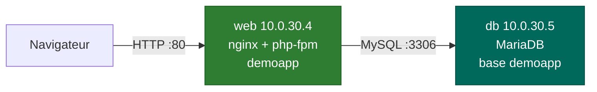
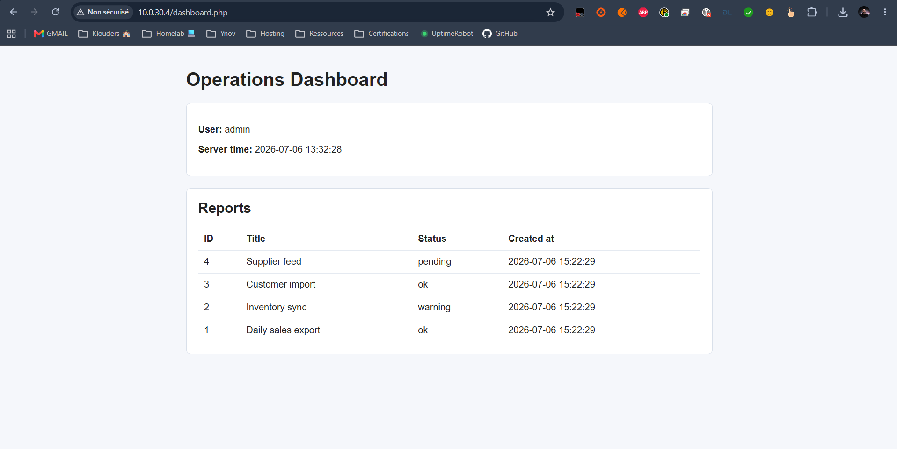

# Services web & db (demoapp)

<div align="center">
  
</div>

## Présentation

Deux VMs métier hébergent une application de démonstration **demoapp** (fournie par le TD monitoring, dépôt [`sountrust/ynov-zabbix-trigger`](https://github.com/sountrust/ynov-zabbix-trigger)) :

- **web** (`10.0.30.4`) - frontal **nginx + php-fpm** servant l'application ;
- **db** (`10.0.30.5`) - base **MariaDB** applicative.

Les deux sont supervisées par un agent Zabbix (voir [Supervision Zabbix](supervision.md)), et leurs identifiants de connexion partagés vivent dans une **source unique** : `group_vars/all.yml`.





---

## VM web (rôle `web`)

Le rôle installe `nginx`, `php-fpm`, `php-mysql`, `php-cli` et déploie l'application :

1. **clone** du dépôt demoapp dans un répertoire source dédié `/opt/demoapp-src` (hors docroot) ;
2. **copie** des fichiers vers le docroot `/var/www/app` (propriété `www-data`) ;
3. **variables de connexion** `DB_*` injectées dans le pool PHP-FPM (`env[DB_HOST]`, `env[DB_NAME]`, etc.) - l'application les lit via `getenv()` ;
4. **vhost nginx** `demoapp` (template `demoapp.nginx.conf.j2`) activé, vhost par défaut désactivé.

!!! note "Pourquoi un répertoire source séparé"
    La VM web contient déjà un ancien checkout dans `/var/www/app` (remote git cassé). Cloner directement dans le docroot échouerait ; on clone donc dans `/opt/demoapp-src` puis on copie. Le vhost bloque aussi les fichiers cachés (`location ~ /\.`) pour ne jamais servir un `.git`.

Pages applicatives : `login.php`, `dashboard.php`, `health.php` (endpoint de santé).

---

## VM db (rôle `db`)

Le rôle installe MariaDB et initialise la base applicative de façon idempotente :

- authentification root via **unix_socket** (`/root/.my.cnf`) - pas de mot de passe root sur Debian ;
- écoute réseau ouverte (`bind-address = 0.0.0.0`) pour que la VM web joigne la base (réseau privé de lab derrière OPNsense) ;
- base **`demoapp`** (utf8mb4) + table **`reports`** + jeu de données de démonstration ;
- utilisateur applicatif **`demo`** avec privilèges `SELECT,INSERT,UPDATE,DELETE` **restreints à l'IP de la VM web**.

| Objet | Valeur (défaut lab) |
|-------|---------------------|
| Base | `demoapp` |
| Utilisateur | `demo` (accès depuis `10.0.30.4`) |
| Table | `reports (id, title, status, created_at)` |
| Port | `3306` |

---

## Identifiants partagés (`group_vars/all.yml`)

Les paramètres de connexion sont définis **une seule fois** et dérivés de l'inventaire (aucune IP en dur dupliquée) :

```yaml
demoapp_db_name: demoapp
demoapp_db_user: demo
demoapp_db_password: "CHANGE_ME_demoapp_db"   # TODO: Vault
demoapp_db_host: "{{ hostvars['db'].ansible_host }}"    # 10.0.30.5
demoapp_web_host: "{{ hostvars['web'].ansible_host }}"  # 10.0.30.4
```

---

## Défaut volontaire { #defaut-volontaire }

L'application écrit **~5 Mo dans `storage/session-cache` à chaque affichage du dashboard**. Le répertoire (pré-créé en écriture pour `www-data`) grossit, le **disque racine se remplit**, et la supervision Zabbix déclenche les triggers `Root filesystem filling up (>80%)` puis `almost full (>90%)`.

C'est le scénario d'alerte de bout en bout : de la métrique (`vfs.fs.size[/,pused]`) au trigger. Voir [Supervision Zabbix](supervision.md#supervision-applicative-du-service-web-via-lapi).

---

## Accès

| Service | Adresse |
|---------|---------|
| Application web | **`http://10.0.30.4/`** |
| Base MariaDB | `10.0.30.5:3306` (base `demoapp`, user `demo`) |

---

## Voir aussi

- [Supervision Zabbix](supervision.md) - items et triggers du service web
- [Configuration Ansible](ansible.md) - rôles `web` et `db`
- [Vault](vault.md) - centralisation des secrets `CHANGE_ME`
