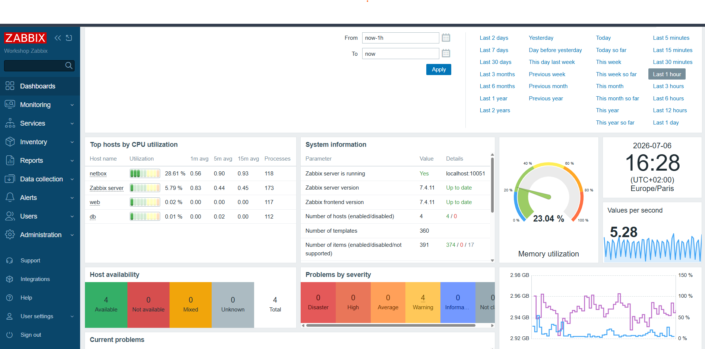

#  Supervision Zabbix

  

## Présentation

La supervision du lab repose sur **Zabbix 7.4**  déployé par Ansible sur l'hôte `zabbix` (`10.0.30.6`, VLAN 30 SRV-LAN) :

- **serveur** Zabbix (backend **MariaDB** local) ;
- **frontend** web **Apache + PHP** (`mod_php`), accessible sur **`http://10.0.30.6/`** ;
- **agents** (agent2) sur `web`, `db` et `netbox`, qui **s'enregistrent automatiquement** sur le serveur via l'API (`zabbix_api_create_hosts`).

!!! info "Ordre de déploiement"
    Le play `zabbix` s'exécute **avant** `web`/`db`/`netbox` : ces hôtes s'enregistrent via l'API au moment où leur agent est installé, le frontend doit donc déjà tourner (cf. [Configuration Ansible](ansible.md)).

---

## Pile déployée

| Composant | Rôle Ansible | Détail |
|-----------|--------------|--------|
| Serveur Zabbix | `community.zabbix.zabbix_server` | Backend MariaDB local (rôle `zabbix` : MariaDB + PyMySQL) |
| Frontend web | `community.zabbix.zabbix_web` | Apache + PHP, vhost à la racine |
| Agent (auto-supervision) | `community.zabbix.zabbix_agent` | agent2 sur l'hôte zabbix lui-même |
| Agents supervisés | `community.zabbix.zabbix_agent` | `web`, `db`, `netbox` (groupe `[agents]`) |

Chaque agent supervisé est lié au groupe *Linux servers* et au template *Linux by Zabbix agent* (disponibilité VM, état de l'agent, CPU, mémoire, disque). Voir `group_vars/agents.yml`.

!!! note "Pré-tâches Apache/Debian"
    Sur Debian, le play `zabbix` applique **avant** le rôle `zabbix_web` : génération des locales `en_US.UTF-8`/`fr_FR.UTF-8`, arrêt de `nginx` (installé par cloud-init, occupe le port 80) et activation de `mod_rewrite`. Détails dans [Configuration Ansible](ansible.md).

---

## Supervision applicative du service web (via l'API)

Au-delà du template Linux, un play dédié (connexion **httpapi** à l'API Zabbix, pas de SSH) ajoute les **checks applicatifs** du service web `demoapp` (voir [Services web & db](services.md)). Ces objets sont créés en IaC dans `playbooks/roles.yml`.

### Items (métriques)

| Item | Clé | Type | Intervalle |
|------|-----|------|-----------|
| Disponibilité HTTP | `net.tcp.service[http,,80]` | simple check (serveur) | 1 min |
| Temps de réponse HTTP | `net.tcp.service.perf[http,,80]` | simple check | 1 min |
| Processus nginx | `proc.num[nginx]` | agent | 1 min |
| Processus php-fpm | `proc.num[,,,php-fpm]` | agent | 1 min |
| Occupation FS racine (%) | `vfs.fs.size[/,pused]` | agent | 1 min |

### Triggers (alertes)

| Trigger | Sévérité | Condition |
|---------|----------|-----------|
| Web service is DOWN | High | HTTP injoignable (`=0`) |
| Web response time is high | Warning | `> 2 s` sur 5 min |
| nginx is not running | High | `proc.num[nginx]=0` |
| php-fpm is not running | High | `proc.num[,,,php-fpm]=0` |
| Root filesystem filling up | Warning | FS racine `> 80 %` |
| Root filesystem almost full | High | FS racine `> 90 %` |

!!! tip "Défaut applicatif volontaire"
    La demoapp écrit ~5 Mo dans `storage/session-cache` à chaque affichage du dashboard : le disque racine se remplit et déclenche les triggers `> 80 %` puis `> 90 %`. C'est le scénario d'alerte de bout en bout du TD (voir [Services web & db](services.md#defaut-volontaire)).

---

## Accès

| Élément | Valeur |
|---------|--------|
| Frontend | **`http://10.0.30.6/`** |
| Compte initial | `Admin` / `zabbix` (à changer) |
| Version | Zabbix 7.4 |

!!! warning "Secrets"
    Le mot de passe `Admin` du frontend et les mots de passe MariaDB sont encore en clair (`zabbix` / `CHANGE_ME`) dans `group_vars/`. À migrer vers [Vault](vault.md) / Ansible Vault.

---

## Voir aussi

- [Configuration Ansible](ansible.md) - rôles et mécanique de déploiement
- [Services web & db](services.md) - l'application supervisée
- [Vault](vault.md) - centralisation des secrets
