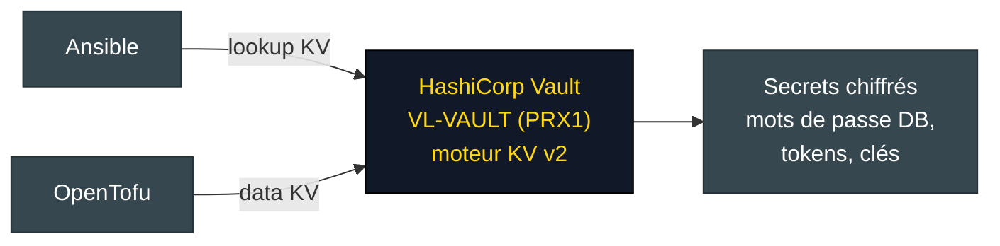
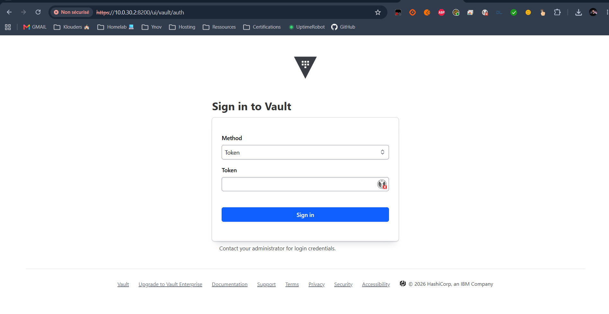

# Vault

<div align="center">
  
</div>

## Présentation

La VM **`VL-VAULT`** (nœud PRX1) héberge un **[HashiCorp Vault](https://developer.hashicorp.com/vault)** qui centralise les **secrets** du lab. Objectif : sortir les mots de passe et tokens des fichiers `group_vars/*` et `terraform.tfvars` (aujourd'hui en clair sous forme de `CHANGE_ME` / valeurs de démonstration) vers un **coffre chiffré** consommé par Ansible et OpenTofu.





!!! info "Déployé hors IaC"
    Comme GitLab, Vault est un service d'infrastructure du lab, déployé séparément (pas par ce dépôt).

---

## Secrets à centraliser

Les secrets actuellement en clair, cibles de la migration vers Vault (moteur **KV v2**) :

| Secret | Source actuelle |
|--------|-----------------|
| Token API Proxmox | `opentofu/terraform.tfvars` |
| Token API NetBox | `opentofu/terraform.tfvars`, `group_vars/netbox.yml` |
| Mots de passe DB/Redis JumpServer | `group_vars/bastion.yml` |
| Mots de passe MariaDB Zabbix | `group_vars/zabbix.yml` |
| Mot de passe DB demoapp | `group_vars/all.yml` |
| Secrets NetBox (SECRET_KEY, superuser, DB) | `group_vars/netbox.yml` |

---

## Consommation

### Ansible

Les rôles liraient les secrets via le lookup `community.hashi_vault` au lieu des variables en clair :

```yaml
demoapp_db_password: "{{ lookup('community.hashi_vault.hashi_vault',
  'secret=kv/data/demoapp:db_password token=' ~ vault_token ~ ' url=https://vl-vault:8200') }}"
```

### OpenTofu

Le provider `hashicorp/vault` (data source `vault_kv_secret_v2`) alimenterait les variables sensibles, ou l'on injecte via `TF_VAR_*` depuis `vault kv get`.

!!! warning "État actuel"
    L'intégration est un **objectif** : les secrets restent aujourd'hui en clair (`CHANGE_ME`). Chaque fichier concerné porte un `TODO: chiffrer avec ansible-vault / Vault`. À court terme, un `vault.yml` chiffré par **Ansible Vault** est le premier palier ; Vault (KV) est la cible finale.

---

## Voir aussi

- [Configuration Ansible](ansible.md) - où vivent les secrets aujourd'hui
- [Sécurité](security.md) - politique de gestion des secrets
- [GitLab](gitlab.md) - autre service d'infrastructure du lab
